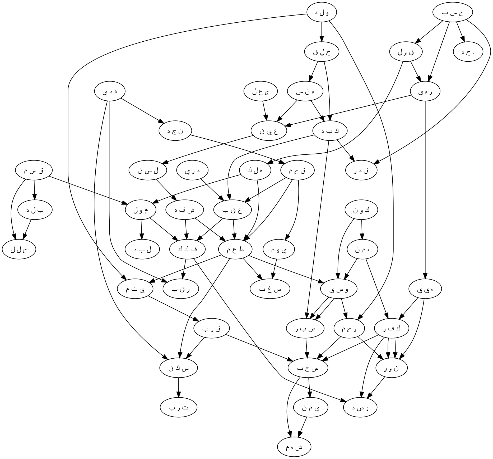

# S90:1–20 Nihai Bütünleştirme Raporu

## Kapsam ve veri disiplini

Bu rapor yalnız S90 için üretilmiş yoğun-sûre özetlerini ve üç perikop paketini bütünleştirir. `DENSE_PASSAGE_GATE.json` içindeki `23,930` aday, `10,000` eşiğini aştığı için bütün-sûre aday havuzu bir etkinleştirme paketi gibi kullanılmamıştır. Bunun yerine 90:1–8, 90:9–16 ve 90:17–20 paketlerinin etkinleştirme, mekanizma, ikincil genişletme, graph ve mekanik keşif sıralaması kayıtları ayrı ayrı okunmuş; uzun menzilli bağlar ancak son bütünleştirme aşamasında kurulmuştur. Mekanik sıralama yorumun sahibi değil, yalnız sürpriz değeri yüksek olabilecek kayıtlar için inceleme kuyruğudur.

Kök çözümleme denetimi temizdir: 45 yüzey kökü vardır; eksik, dışarıda bırakılmış veya birleştirme istisnası yoktur. Üç perikoptaki branch envanteri bütün-sûre envanterini eksiksiz ve çakışmasız kaplar.

| Birim | Ayet | Kök | Branch | A | B | C/B | C | S | X | Graph düğümü | Graph kenarı |
|---|---:|---:|---:|---:|---:|---:|---:|---:|---:|---:|---:|
| p01 | 1–8 | 17 | 175 | 19 | 37 | 43 | 72 | 4 | 0 | 17 | 4,079 |
| p02 | 9–16 | 16 | 149 | 16 | 47 | 36 | 48 | 2 | 0 | 16 | 3,447 |
| p03 | 17–20 | 12 | 93 | 14 | 40 | 10 | 29 | 0 | 0 | 12 | 1,165 |
| **Toplam** | **1–20** | **45** | **417** | **49** | **124** | **89** | **149** | **6** | **0** | **45** | **8,691** |

Yoğun özet havuzunda 754 aynı-perikop ve 23,176 perikoplar-arası olmak üzere 23,930 mekanik aday vardır. Bu sayılar olası bağ yoğunluğunu gösterir; aşağıdaki okumaların hiçbiri yalnız bağlantı sayısından türetilmemiştir.

## Kısa nihai rapor

Sûrenin birincil hareketi, insana verilmiş olanla insanın kendisine mal ettiği şey arasındaki çatışmayla başlar. Yemin, belirli ve sınırlı şehirdeki işaretli hukukî-kutsal durumu; ebeveyn, çocuk ve doğumu; insanın yaratılışını ve `كَبَد` içindeki zahmetli varoluşunu tek çerçevede toplar. Bu çerçevenin içindeki insan ise iki yanlış hesap yapar: hiç kimsenin kendisine güç yetiremeyeceğini ve hiç kimsenin onu görmediğini sanır. “Yığınla mal tükettim” sözü, harcamayı toplumsal statüye çevirmeye çalışır; fakat ona iki gözü veren ilahî yapma fiili hem gücünün türetilmiş olduğunu hem de eylemin ilkece görülebilir ve hesaba açık kaldığını gösterir.

İkinci perikop, ilk bölümdeki beden bağışını genişletir: gözlerin yanına dil ve iki dudak, yaratılmış ölçünün yanına iki yüksek yolun gösterilmesi gelir. Fakat kapasite ve bilgi tek başına yükseliş değildir. İnsan sarp engeli aşmamıştır; vahiy bu engeli soyut bir manevî çaba olarak bırakmayıp bir boynu bağdan çözmek veya açlık gününde yakın akraba olan yetimi ve toprağa yapışmış yoksulu doyurmak diye açıklar. Böylece “yükseğe çıkmak”, statüce aşağı itilmiş olana doğru hareket etmekle gerçekleşir. Rehberlik eyleme, sahiplik özgürleştirmeye, mal ise hayatı sürdüren azığa çevrilmedikçe verilmiş imkân tamamlanmış sayılmaz.

Üçüncü perikop, tekil yardım fiillerini kalıcı bir topluluk biçimine dönüştürür. Özgürleştiren ve doyuran kişi ayrıca iman edenlerden “olur”; bu topluluk sabrı ve merhameti karşılıklı olarak birbirine taşır. Bu içten sürdürülen dayanışma `أَصْحَٰبُ ٱلْمَيْمَنَةِ` ile sonuçlanır. Karşı kutupta işaretleri örtenler `أَصْحَٰبُ ٱلْمَشْـَٔمَةِ` olur ve üzerlerine mühürlenmiş ateş kapanır. Bütün sûrenin ana karşıtlığı bu yüzden yalnız iyi ve kötü kişi karşıtlığı değildir: **içeriden karşılıklı güven, sabır ve merhametle ayakta tutulan topluluk ile dışarıdan kapanmaya zorlanan topluluk** karşıtlığıdır.

Perikoplar birlikte okunduğunda ana mekanizma şöyledir:

```text
verilmiş yer, soy, beden ve algı
→ yaratılmış ölçüyü unutan güç/servet/görünmezlik hesabı
→ dil, dudaklar ve rehberlikle açılan ahlâkî seçenek
→ sarp yolun özgürleştirme ve kıtlıkta doyurma olarak somutlaşması
→ tekil bakımın iman, karşılıklı sabır ve merhamet topluluğuna dönüşmesi
→ sağ/bereket yönünde koruyucu yoldaşlık

karşı hat:
bağışı özerk mülk sayma ve işareti örtme
→ yardım yoluna girmeme
→ ilişkileri kesen olumsuz grup aidiyeti
→ ateşin dıştan mühürlenmiş kapanışı
```

İkincil okumalar birincil hattı değiştirmeden onu daha maddî ve ilişkisel kılar. `ك ب د` yalnız çekilen acı değil, ölçülü ve dik duran bedenin sınırlılığıdır; `ح س ب` yalnız sanmak değil, yanlış muhasebedir; harcama miktarla değil paylaştırma, geride kalan yeterlilik ve hane üzerindeki sonuçla ölçülür. Göz hem tanık hem gözeten bakım; ağız hem konuşma hem talebi işitme, besleme ve bakım arayüzüdür. Özgürleştirme yalnız bağı kesmek değil, hareketi, güvenliği, haneyi ve toplumsal yeniden-katılımı mümkün kılmaktır. Açlık tek öğün eksikliği değil; kuraklık, başarısız büyüme, yerinden edilme ve mesken kaybı zinciridir. Son bölümde “sağ taraf” sahip olunan gücün nasıl kullanıldığıyla hazırlanır; “örtme” ise rahimde, tohumda ve meyvede gelişimi koruyabildiği gibi işareti boğup son imkânı kapatan mühürlemeye de dönüşebilir.

## Etkinleşmiş branch tablosu

Aşağıdaki tabloda bütün `A`, `B` ve `C/B` branch’ler korunmuştur. Her satır, branch’lerin ortak işlevini, yerel delilini, etkinleşme akışını ve yalnız yüzey karşılığıyla kaybolacak unsuru özetler. Branch ID’leri ve teknik etiketler kaynak kayıtlardaki biçimleriyle bırakılmıştır.

### p01 — 90:1–8

| Kök | A | B | C/B | İşlev, delil ve akış | Yalnız yüzeyde kaybolan |
|---|---|---|---|---|---|
| `ق س م` | `B004` | `B003, B006` | `B001` | 90:1’deki yemin `ب ل د` ve `ح ل ل` alanını kurar; paylaştırma ve muhasebe portları `م و ل` ile harcama hesabını açar. | Yemin yalnız vurgu olur; servetin kime ayrıldığı sorusu görünmez. |
| `ب ل د` | `B001` | `B009` | `B005, B008` | Tekrarlanan “bu şehir”, sınırlandırılmış yer ve ikamet alanıdır; `ح ل ل` ile hukukî-kutsal durum, `ل ب د` ile yerde kalma etkinleşir. | İddia sahibinin somut, iskân edilmiş ve toplumsal olarak görünür bir yerde oluşu kaybolur. |
| `ح ل ل` | `B003` | `B002, B004, B005, B006` | `B001, B012` | `حِلّ` doğrudan yasak/koruma statüsünü; yerleşme, vadesi gelen yükümlülük, yemin bağından çözülme ve hane ilişkisini açar. | Şehir ile dokunulmazlık, yükümlülük ve hesap arasındaki gerilim silinir. |
| `و ل د` | `B001, B002, B003` | `B005` | `B004, B006` | Ebeveyn, çocuk ve doğum; soy sürmesi ve ev içi ilişki üzerinden `خ ل ق`, `ء ن س` ve sonraki yetim/akrabalık hattını başlatır. | İnsan soy ve bakımdan bağımsız, kendini kurmuş bir birey gibi görünür. |
| `خ ل ق` | `B002` | `B001, B003, B004` | `B005, B007, B012` | İlâhî yaratma; ölçülü form, tamamlanmış beden ve karakter üzerinden `ك ب د`, `ج ع ل` ve `ع ي ن`e akar; sözel uydurma portu insanın söylemiyle karşıtlık kurar. | Yaratma yalnız başlangıç olayı olur; ölçü, biçim ve hakikat/uydurma karşıtlığı kaybolur. |
| `ء ن س` | `B001` | `B002, B005` | `B003, B006` | İnsan varlığı, algısal farkındalık ve gözde beliren insan imgesi `ر ء ي`–`ع ي ن` hattını; yakın insan ilişkisi statünün ilişkisel oluşunu destekler. | Görülme soyut bir tehditte kalır; kişiler arası algı ve yakınlık görünmez. |
| `ك ب د` | `B002` | `B003, B009` | `B001, B006, B007` | Zahmet, bedenin merkezi ve dik duruşu `ق د ر`ın ölçü portlarıyla birleşir; yaratılmış insanın dayanma sınırını kurar. | Zahmet düzensiz bir talihsizlik sanılır; ölçülü beden ve dayanıklılık boyutu kaybolur. |
| `ح س ب` | `B002` | `B001, B006` | `B003, B004, B010` | İki kez yinelenen sanı, sayma, hesap, gözetim, yeterlilik ve itibar hesabına dönüşür; `ق د ر`, `ء ح د`, `ق و ل`, `ر ء ي`yi tetikler. | İki soru ayrı yanılgılar gibi görünür; ortak yanlış muhasebe mekanizması kaybolur. |
| `ق د ر` | `B003` | `B001, B005, B006` | `B002, B004` | Etkin güç doğrudan anlamdır; ölçü, tahsis ve uygun oran `ك ب د` ve `خ ل ق` tarafından etkinleştirilir. | “Kimse bana güç yetiremez” iddiasının ölçülmüş bedende söylenmesi ironisi kaybolur. |
| `ء ح د` | `B002` | `B003, B005` | `B001` | Kapsayıcı olumsuzlukta “hiç kimse”, sayılabilir tek ve birlik portlarıyla `ح س ب` hesabına bağlanır. | “Sıfır güç sahibi, sıfır tanık” biçimindeki hatalı envanter görünmez. |
| `ق و ل` | `B001` | `B005, B006, B007, B011` | `B012, B013, B014, B016` | Açık söz; iddia, kendine mal etme, dolaşıma sokma ve elde tutulan söylem olarak `ه ل ك`–`م و ل` övünmesini kamusallaştırır. | Söz, görünmezliği bozan bir iz ve tanıklık üretme eylemi olmaktan çıkar. |
| `ه ل ك` | `B001` | `B009` | `B002, B004, B011, B012, B013` | Tüketme/yok etme, kaynak bitirme; yoksullaşma, faydasızlık ve hane yıkımı ihtimalleriyle `م و ل`un sonucunu sorgular. | Harcama yalnız büyüklük göstergesi olur; yeterlilik ve ilişkisel maliyet hesaba girmez. |
| `م و ل` | `B001` | — | — | Yüzeyde maldır; `ه ل ك`, `ل ب د`, `ق س م` ve `ح س ب` tarafından tüketilen, yığılan ve paylaştırılması gereken kaynak olarak konumlanır. | Malın ahlâkî niteliğinin miktardan değil kullanım yönünden doğduğu görünmez. |
| `ل ب د` | `B002` | `B001` | `B003, B007` | Yığılmış mal, katman katman sıkışma ve yerde kalma portlarıyla servet yoğunluğu ile şehirde yerleşiklik arasında bağ kurar. | “Çok” anlamının birikme, sıkışma ve yapışma maddeselliği kaybolur. |
| `ر ء ي` | `B001` | `B002, B005, B012` | `B006, B013` | Görme; değerlendirme, kamusal görünürlük ve araştırıcı tanıklık olarak ikinci `ح س ب` sorusunu `ع ي ن`e taşır. | Görme yalnız fizikî bakış olur; bilme, hüküm ve toplumsal tanıklık kaybolur. |
| `ج ع ل` | `B001` | `B002, B004` | `B003, B005, B012` | İlâhî yapma iki gözü verir; üretme, tahsis ve adlandırma portları `خ ل ق` ile ilâhî fiili, `ق و ل` ile insanın retorik “yapmasını” karşılaştırır. | Gözler salt nimet listesi olur; gerçek yapma ile anlatı üretme karşıtlığı kaybolur. |
| `ع ي ن` | `B001` | `B002, B003, B011, B016` | `B005, B009, B012, B013, B015, B017` | Göz; görgü tanıklığı, gözeten bakım, hazır nakit/değer ve çiftli anatomik biçim olarak görme inkârını cevaplar; sosyal gözetim ve statü portları da açık kalır. | Organın hem delil, hem bakım, hem hesap birimi işlevi görünmez. |

### p02 — 90:9–16

| Kök | A | B | C/B | İşlev, delil ve akış | Yalnız yüzeyde kaybolan |
|---|---|---|---|---|---|
| `ل س ن` | `B001` | `B003, B006, B008` | `B002, B005, B007, B010` | Dil, belagat, dil sistemi ve mesajı `ش ف ه` ile konuşma arayüzü yapar; saldırı, yaralanma ve bozulma portları bu nimetin kötüye kullanımını gösterir. | Dil pasif organ kalır; hakikati bildirme, ihtiyacı tanıma veya incitme sorumluluğu kaybolur. |
| `ش ف ه` | `B001` | `B002, B003` | `B004` | Dudaklar, sözlü tanıklık ve tekrar eden isteme üzerinden `ط ع م`a; anatomik ağız/çene portuyla `ف ك ك`a bağlanır. | Ağız ile talep, besleme ve özgürleştirme arasındaki bedenî süreklilik görünmez. |
| `ه د ي` | `B001` | `B002, B004, B007, B010` | `B005, B009` | Rehberlik; yön, bağış, esiri koruma ve ölçülü davranış olarak `ن ج د`den `ر ق ب` ve `س ك ن`e uzanır. | Yol gösterme soyut bilgi olur; koruma, verme ve davranış yönü kaybolur. |
| `ن ج د` | `B001` | `B002, B004, B005, B010` | `B003, B006, B012` | İki yüksek yol; açıklık, ileri hareket, sıkıntı ve zorlukta edinilen bilgiyle `ق ح م`ı etkinleştirir. | Yükseklik salt topoğrafya olur; seçimin açıklığı ve bedelli bilgisi görünmez. |
| `ق ح م` | `B001` | `B002, B003` | `B006, B007` | Sarp işe atılma; yol tehlikesi ve kuraklık yılıyla `ع ق ب`, `ي و م`, `س غ ب` hattını açar; yanlış değerleme ve yerinden edilme sınırda tutulur. | Aşmama yalnız irade zayıflığı olur; kriz, maliyet ve yanlış değer biçme kaybolur. |
| `ع ق ب` | `B012` | `B002, B004, B006, B007, B010` | `B003, B005, B008, B015` | Sarp engel; tırmanma, sonuç, yaptırım, nesil, inceleme ve hukukî ikame üzerinden `ف ك ك` ve `ق ر ب`e çözülür. | Engelin toplumsal, hukukî ve kuşaklar arası yapısı görünmez. |
| `د ر ي` | `B001` | `B002, B006` | — | Bildirilen bilgi, kasıtlı yöneliş ve insanlarla uzlaştırıcı muamele olarak engelin tanımını pratik bir yönlendirmeye çevirir. | `وَمَا أَدْرَىٰكَ` yalnız sözlük açıklaması olur. |
| `ف ك ك` | `B002` | `B001` | `B003, B004, B006, B009` | Bağdan çözme, açma; ağız/çene, muhakeme ve çocuk bakımı portlarıyla `ر ق ب`daki hukukî özgürlüğü bedensel ve ilişkisel yeniden-katılıma taşır. | Özgürleştirme tek seferlik bir hukuk işlemi gibi kalır. |
| `ر ق ب` | `B004` | `B002, B005, B008, B012, B013` | `B001, B015` | Boyun, köleleştirilmiş kişi; mülkiyet, koruma, hane/soy ve gözetim portlarıyla çözmenin nesnesini tam kişi olarak kurar. | “Boyun” mecazı arkasındaki güvenlik, sahiplik ve bağımlı kişi görünmez. |
| `ط ع م` | `B002` | `B001, B004, B008, B011` | `B005, B012, B014` | Doyurma; yeme, geçim, ahlâkî ayırt etme ve sunulan azık üzerinden `س غ ب`, `ي ت م`, `س ك ن`e cevap verir; hasat ve süreklilik portları kıtlığın ekolojisini açar. | Yemek tek porsiyona iner; geçim, üretim döngüsü ve devamlılık kaybolur. |
| `ي و م` | `B001` | `B002, B003` | `B004` | Sınırlandırılmış gün; süre ve olay olarak kuraklık/açlık krizine zaman ufku verir. | Açlık zamansız bir durum olur; kriz boyunca sürdürme yükü görünmez. |
| `س غ ب` | `B001` | — | — | Açlık ve tükenme doğrudan `ط ع م`ın cevap verdiği krizdir; `ق ح م B003` kuraklık portu bunu büyütür. | Doyurmanın aciliyeti ve bedensel tükenme kaybolur. |
| `ي ت م` | `B001` | `B003, B004` | `B002, B005` | Yetimlik; ihmale açık çocuk ve kayıp koruma olarak `ق ر ب`la akrabalık yükümlülüğünü, hane sürekliliği sorununu açar. | Alıcı anonim yoksula dönüşür; bakım kaybı ve yakınlık sorumluluğu görünmez. |
| `ق ر ب` | `B003` | `B001, B004, B006, B007` | `B002, B005, B015, B016` | Yakın akrabalık; yaklaşma, nesep, fizikî/ahlâkî yakınlık olarak yetime ve yoksula doğru hareketi kurar. | “Yakın” yalnız soy etiketi olur; fiilî yaklaşma ve bakım mesafesi kaybolur. |
| `س ك ن` | `B006` | `B002, B003, B009, B010` | `B001, B004, B005` | Yoksul kişi; mesken, hane, sakinlik ve yerleşebilme üzerinden `ط ع م`ı barınma ve kalıcılığa bağlar. | Yoksulluk yalnız gelir eksikliği olur; mesken ve yerinden edilme görünmez. |
| `ت ر ب` | `B002` | `B001, B003, B004` | `B006` | Toprağa yapışmışlık; toz, yeryüzü, mal ve akranlık portlarıyla yoksunluğun bedensel/statüsel dibini gösterir. | Toz sadece şiirsel süs olur; mülkiyet ile mülksüzlüğün tersliği kaybolur. |

### p03 — 90:17–20

| Kök | A | B | C/B | İşlev, delil ve akış | Yalnız yüzeyde kaybolan |
|---|---|---|---|---|---|
| `ك و ن` | `B001` | `B002, B003, B004, B006` | — | “Olmak”, iman topluluğunda yer, sorumluluk ve sonuç durumuna geçiştir; önceki fiilleri kalıcı kimliğe bağlar. | Özgürleştirme ve doyurma, topluluk biçimi üretmeyen tekil işler olarak kalır. |
| `ء م ن` | `B002` | `B001` | `B003` | İman, işaretlere güvenen tasdik; güvenlik ve güvenilir dayanışma üretir, karşılıklı öğüdü etkinleştirir. | İnanç yalnız zihinsel kabul olur; toplumsal emniyet sonucu kaybolur. |
| `و ص ي` | `B003` | `B002` | `B001, B004` | Karşılıklı öğüt, bağlayıcı yükümlülük ve süreklilik aktarımıdır; azık/otlak portu önceki doyurma sahnesini `ص ب ر` ve `ر ح م`e taşır. | Öğüt gündelik tavsiye olur; topluluğu besleyen ve bağlayan yapı görünmez. |
| `ص ب ر` | `B001` | `B002, B003, B006, B012, B013, B014, B015, B018` | `B009, B011` | Gönüllü dayanma ve ortak yük taşıma; zoraki tutma, karşılık, hükmü bekleme ve ateşe cüret karşıtlarıyla `ص ح ب` ve `و ص د` kutuplarını kurar. | Sabır yalnız bireysel tahammül olur; ortak sorumluluk ve zorunlu kapanma karşıtı kaybolur. |
| `ر ح م` | `B001` | `B002` | `B003` | Merhamet, şefkat ve iyilik; akrabalık yükümlülüğü ve koruyucu rahim imgesiyle toplumsal bakımı süreklileştirir. | Merhamet duygusal ek olur; bakımın akraba gibi bağlayıcı niteliği kaybolur. |
| `ص ح ب` | `B001` | `B002, B003, B004` | — | Tekrarlanan yoldaşlık, koruyucu eşlik, isteyerek uyum ve süreklilik olarak her iki grubun kalıcı aidiyetini kurar. | Sağ/sol yalnız son anda verilen etiket olur; aidiyetin süreç içinde oluşması kaybolur. |
| `ي م ن` | `B001, B002` | `B003, B004, B007` | `B006` | Sağ taraf ve bereket; ahit, güvenilir yükümlülük, haklı güç ve son yöneliş olarak önceki özgürleştirme/doyurma eylemlerini sınıflandırır. | Sağ yön mekânsal sembole iner; güç ve mülkün sorumlu kullanımı görünmez. |
| `ك ف ر` | `B003` | `B001, B002, B004, B005, B006, B009, B014` | `B007, B011, B013` | İşaretleri reddetme; örtme, karanlık, nankörlük, ilişkiyi kesme ve olumlu kefaret imkânıyla `ء ي ي`den `ن و ر` ve `و ص د`a geçişi kurar. | Küfür yalnız fikir uyuşmazlığı olur; algısal, şükranla ilgili ve sosyal kopuş görünmez. |
| `ء ي ي` | `B003` | `B002, B008, B009, B010` | — | İlâhî işaretler; dikkat yöneltme, açıklama, toplumsal hitap ve ciddi tanıklık ister; `ك ف ر` bu açık çağrıyı örter. | Red, delil yokluğundan doğmuş gibi görünür. |
| `ش ء م` | `B001, B003` | — | — | Sol taraf ve uğursuz/olumsuz sonuç, `ي م ن` ile son yön ve kader karşıtlığını kurar. | Sol tarafın ahlâkî-sonuçsal yönelimi kaybolur. |
| `ن و ر` | `B002` | `B001, B003, B005, B006, B007, B010` | — | Yüzeyde ateş; ışık, uyarı, işaret, sınır ve rehberlikten kaçış portlarıyla reddedilen aydınlığın cezalandırıcı görünürlüğe dönüşmesini gösterir. | Ateş yalnız fizikî ceza olur; reddedilmiş rehberliğin tersine çevrilmesi kaybolur. |
| `و ص د` | `B001` | `B002, B003` | — | Mühürleyip kapatma, kapı/eşik ve taş çevre olarak `ن و ر`u dıştan kapanan mimariye dönüştürür. | Son sıfat yalnız “kapalı” der; iç örtmenin dış kapanmaya dönüşmesi görünmez. |

## İkincil etkinleşme tablosu

Bu tablo `07-secondary-expansion.json` içindeki bütün alternatif mekanizmaları korur. `suggested_label`, birincil envanter etiketinin yerine geçirilmiş yeni bir hüküm değil, ikincil inceleme kaydındaki öneridir.

| Perikop | Mekanizma adı | suggested_label | Branch yolu | Birincil okumada yaptığı değişiklik |
|---|---|---|---|---|
| p01 | `received_lineage_versus_self_made_prestige` | `B` | `و ل د B002 → و ل د B001 → ح ل ل B006 → ء ن س B006 → ع ي ن B015 → ح س ب B004 → ق و ل B006` | Soy, hane ve tanınmış statü övünmeden önce gelir; kişi ilişkilerden aldığı itibarı kendinden doğmuş dokunulmazlık gibi sunar. |
| p01 | `divine_creation_versus_human_fabrication` | `B` | `خ ل ق B002 → ج ع ل B001 → ع ي ن B001 → خ ل ق B007 → ج ع ل B003 → ق و ل B005 → ه ل ك B011` | İlâhî yaratma yargılama organını kurarken insan retorik bir kayıp/itibar anlatısı “yapar”; ontolojik yapma ile sözel uydurma ayrılır. |
| p01 | `boasted_expenditure_and_relational_ruin` | `B` | `ق س م B003 → م و ل B001 → ه ل ك B001 → ه ل ك B004 → ه ل ك B013 → ح س ب B003 → ح ل ل B006` | Harcama büyüklükle değil pay, kalan yeterlilik ve hane üzerindeki sonuçla sınanır. |
| p01 | `generation_requires_habitat_and_nurture` | `C/B` | `و ل د B003 → ج ع ل B009 → ر ء ي B010 → ح ل ل B009 → ل ب د B006 → ب ل د B012 → ج ع ل B010` | Doğum; habitat, beslenme ve bağımlı gelişim gerektiren bir süreç olur; hayvan ayrıntıları yüzeye taşınmaz. |
| p01 | `inhabited_city_defeats_social_invisibility` | `C/B` | `ب ل د B009 → ح ل ل B002 → ع ي ن B017 → ر ء ي B004 → ع ي ن B005 → ء ح د B002` | İskân edilmiş şehir, “kimse görmedi” savını ilâhî tanıklıktan önce toplumsal olarak da istikrarsızlaştırır. |
| p01 | `the_eye_between_care_and_surveillance` | `B` | `ع ي ن B001 → ع ي ن B002 → ع ي ن B003 → ع ي ن B005 → ء ن س B002 → ر ء ي B001` | Görülme yalnız düşmanca gözetim değildir; basmala çerçevesinde zahmetin bilinmesi ve gözetilmesi de olabilir. |
| p01 | `the_apportioned_face_as_counterevidence` | `C/B` | `ق س م B001 → خ ل ق B003 → ب ل د B003 → ء ن س B005 → ر ء ي B006 → ع ي ن B001 → ع ي ن B016` | Ölçülü yüz ve çift göz, sınırsız güç ve görünmezlik iddiasına kişinin kendi morfolojisini karşı-delil yapar. |
| p02 | `speech_that_wounds_or_reconciles` | `B` | `ل س ن B002 → ل س ن B010 → ش ف ه B002 → د ر ي B006 → ش ف ه B004 → ع ق ب B008` | Verilmiş söz yetisi incitebilir, yalanlayabilir, tanıklık edebilir veya haksız düzeni sorgulayıp onarabilir. |
| p02 | `disciplined_valuation_of_the_costly_way` | `C/B` | `ن ج د B002 → ق ح م B007 → ه د ي B009 → ف ك ك B006 → ط ع م B008 → ه د ي B010 → ي ت م B003` | Sarp yardımın “kayıp”, savsaklamanın “kolaylık” sayılmasını yanlış değerleme olarak teşhis eder. |
| p02 | `assisted_ascent_and_rehabilitative_release` | `C/B` | `ه د ي B008 → ع ق ب B002 → ن ج د B006 → ف ك ك B005 → ق ر ب B015 → ف ك ك B009` | Yükseliş tek başına kahramanlık değil destekli hareket; özgürleşme de işlevsel hareket ve bakımın geri verilmesidir. |
| p02 | `famine_displacement_and_the_need_to_stay` | `C/B` | `ق ح م B003 → ق ح م B006 → ق ر ب B008 → س ك ن B010 → ط ع م B004 → س ك ن B002 → ت ر ب B002` | Açlık, kuraklığın yerinden etme baskısına ve mesken kaybına bağlanır; doyurma kalabilmeyi de mümkün kılar. |
| p02 | `household_continuity_for_unsupported_dependents` | `C/B` | `ه د ي B006 → ي ت م B005 → ر ق ب B008 → ع ق ب B004 → ر ق ب B013 → ق ر ب B003 → س ك ن B003` | Yetimin ihtiyacı, koruma ve hane sürekliliğinin kırılması olarak genişler; yüzey alıcısı değiştirilmez. |
| p02 | `release_followed_by_reintegration` | `C/B` | `ف ك ك B001 → ف ك ك B002 → ط ع م B010 → ق ر ب B001 → ف ك ك B009 → س ك ن B002` | Bağdan ayırmanın ardından yakınlık, besleme, bakım ve meskene katılma gerekir; özgürlük terk edilme değildir. |
| p02 | `the_cosmic_bowl_of_the_poor` | `C` | `ف ك ك B008 → ر ق ب B007 → ي و م B001 → ي و م B002 → ط ع م B014 → ق ر ب B009` | Yıldızsal “yoksul tası” analojisi unutulmaz ama gece/yıldız tetikleyicisi olmadığı için mekanizmaya yükseltilmez. |
| p02 | `adornment_displaced_by_bodily_need` | `C` | `ن ج د B009 → ت ر ب B005 → ر ق ب B012 → ت ر ب B003 → ت ر ب B002 → ط ع م B001` | Bedeni süsleyen veya statü gösteren kaynak, bağlı boyun ve aç bedenin talebiyle karşılaştırılır; takı/silah yüzey olayı değildir. |
| p03 | `true_patience_versus_audacity_toward_fire` | `B` | `ص ب ر B001 → ص ب ر B013 → ك ف ر B003 → ن و ر B002 → و ص د B001` | Gönüllü özdenetimin yıkıcı parodisi, reddedişte ateşe karşı cüretkâr ısrardır; sonunda dış mühür özdenetimin yerini alır. |
| p03 | `nurtured_community_and_branded_classification` | `C/B` | `و ص ي B004 → ص ب ر B011 → ر ح م B001 → ص ح ب B001 → ن و ر B002 → ص ح ب B008` | Öğüt/azık topluluğu beslerken ateşin işaretleme portu olumsuz grubun sonuçla damgalanmasını resmeder. |
| p03 | `willing_alignment_versus_penned_compliance` | `B` | `ء م ن B002 → و ص ي B003 → ص ح ب B003 → و ص د B003 → و ص د B001` | Sağdaki topluluk içeriden gönüllü uyumla; soldaki grup sonunda dıştan çevreleme ve mühürle tutulur. |
| p03 | `visible_sign_darkness_and_punitive_light` | `B` | `ء ي ي B003 → ن و ر B001 → ك ف ر B002 → ك ف ر B003 → ن و ر B002` | Görünür ve aydınlatıcı işaret, seçilen karanlıkla örtülür; görünürlük ceza ateşi olarak geri döner. |
| p03 | `guidance_carried_along_a_path_then_stopped` | `C/B` | `ص ح ب B004 → ن و ر B011 → ن و ر B005 → ص ب ر B018 → و ص د B001` | Yoldaşlık rehberlik izini taşır; tıkaç ve mühür hareket ile erişimin durduğu karşı kutbu kurar. |
| p03 | `restorative_generative_and_terminal_coverings` | `C/B` | `ك ف ر B009 → ك ف ر B011 → ك ف ر B008 → ك ف ر B010 → ك ف ر B003 → و ص د B001` | Örtme arındırabilir veya gelişimi koruyabilir; hakikati örtme ise imkânı reddedip son kapanmaya varır. |
| p03 | `right_side_as_use_of_power_and_final_orientation` | `C/B` | `ي م ن B004 → ي م ن B006 → ي م ن B003 → ي م ن B002 → ي م ن B007` | Sağ taraf, mülk ve gücün özgürleştirme/doyurmaya yöneltilmesiyle hazırlanmış ahit ve son yönelim olur. |
| p03 | `living_surface_and_sealed_surface` | `C/B` | `ص ب ر B004 → ص ح ب B007 → و ص د B004 → ك ف ر B010 → و ص د B001` | Yüzey, hayat ve kök bağlantısı taşıyabilir veya soldakilerin üstünde kapalı sınır hâline gelebilir. |
| p03 | `weather_endurance_and_overhead_enclosure` | `C` | `ص ب ر B007 → ص ب ر B010 → ك ف ر B002 → ن و ر B002 → و ص د B001` | Soğuk ve katmanlı bulut, üstten örtülü zorluğun uzak modelidir; ayetlerde hava olayı olmadığı için `C` kalır. |
| p03 | `mercy_continues_after_emergence` | `C/B` | `ر ح م B003 → ر ح م B004 → و ص ي B004 → ص ب ر B011 → ر ح م B001` | Merhamet, korunan gelişimden doğum sonrası kırılganlığa ve azık paylaşımına kadar devam eden bakım olur. |
| p03 | `biography_matures_and_becomes_legible` | `C` | `ك و ن B005 → ص ح ب B005 → ك ف ر B006 → ص ح ب B008 → ن و ر B008` | Biriken tercihlerin son aidiyette okunur hâle gelmesi uzak bir yazı/renk analojisi üretir; literal yaşlanma veya işaretleme değildir. |

### C ve S rezervuarı

`C` branch’ler silinmemiş, kök bazında kompakt delil iziyle korunmuştur. `S` yalnız görünür yerel köprü bulunmadığını gösterir; veri sorunu değildir.

| Perikop | Kök | C | S | Kompakt delil izi |
|---|---|---|---|---|
| p01 | `ق س م` | `B002, B005, B007, B008` | — | Yemin, karar, katlama ve çatışma portları; yerel maddî tetikleyici zayıf. |
| p01 | `ب ل د` | `B002, B003, B004, B006, B007, B010, B011, B012` | — | Yer, yüz/anatomi, savaş ve habitat ağları; şehir/yaratılış bağları incelemeyi açık tutar. |
| p01 | `ح ل ل` | `B007, B008, B009, B010, B011, B013, B014, B015` | — | Doğum sonrası besleme, çözülme ve ikamet çevresi; hayvan/nesne ayrıntıları yüzeyde yok. |
| p01 | `و ل د` | — | `B007` | Acil durum deyimi için yerel tetikleyici yoktur. |
| p01 | `خ ل ق` | `B006, B008, B009, B010, B011` | — | Yaratma/uydurma ve beden dokusu çevresindeki uzak maddî portlar. |
| p01 | `ء ن س` | `B004, B007` | — | Yabanilik ve soyut yakınlık karşıtları; insan/görme hattı zayıf destek verir. |
| p01 | `ك ب د` | `B004, B005, B008` | — | Yay tutuşu, araç ve maddî beden portları; yerel nesne yoktur. |
| p01 | `ح س ب` | `B005, B008, B009` | `B007` | İtibar/hesap çevresindeki uzak deyimler korunur; `B007` için görünür tetikleyici yoktur. |
| p01 | `ق د ر` | `B007` | — | Güç/ölçü alanındaki uzak dal, sınırlı biçim bağıyla saklanır. |
| p01 | `ء ح د` | `B004, B006` | — | Birlik ve tekillik çevresindeki özel portlar, tekrarlanan `أَحَد` sebebiyle açık tutulur. |
| p01 | `ق و ل` | `B002, B003, B004, B008, B009, B010, B015, B017` | — | Söylem, aktarım, oyun/araç ve deyim portları; açık övünme yalnız genel destek verir. |
| p01 | `ه ل ك` | `B003, B005, B006, B007, B008, B010` | — | Yok oluşun özel nesne/olay dalları, kaynak tüketimi çevresinde keşif düzeyinde kalır. |
| p01 | `ل ب د` | `B004, B005, B006` | `B008` | Küme, doku ve beslenmeyle dolgunlaşma portları; `B008` tetikleyicisizdir. |
| p01 | `ر ء ي` | `B003, B004, B007, B008, B009, B010, B011` | — | Karşılaşma, görünüm, gebeliğin görünmesi ve özel görme portları; şehir/soy/göz ağından zayıf destek. |
| p01 | `ج ع ل` | `B006, B007, B008, B009, B010, B011` | — | Üreme, yavru, araç ve dönüştürme portları; doğum ve yapma fiiliyle keşif düzeyinde bağlı. |
| p01 | `ع ي ن` | `B004, B006, B007, B008, B010, B014` | — | Gözün özel anatomi, kaynak ve gözetim dalları; iki göz yalnız genel tetikleyici sağlar. |
| p01 | `م و ل` | — | `B002` | İkinci servet dalı için görünür yerel köprü yoktur. |
| p02 | `ل س ن` | `B004, B009` | — | Dilin özel araç/deyim dalları; konuşma organı uzaktan destekler. |
| p02 | `ش ف ه` | — | — | Bütün envanter `A/B/C/B` içindedir. |
| p02 | `ه د ي` | `B003, B006, B008, B011` | — | Hane geçişi, destekli yürüyüş ve özel yöneltme dalları; rehberlik/bakım analojileriyle korunur. |
| p02 | `ن ج د` | `B007, B008, B009, B011` | — | Süs, beden ve özel arazi portları; sarp yol çevresinde uzak kalır. |
| p02 | `ق ح م` | `B004, B005` | — | Zayıflık/araç gibi özel kriz dalları; zorluk alanından zayıf destek. |
| p02 | `ع ق ب` | `B001, B009, B011, B013` | `B014` | Beden, ardıllık ve özel sonuç portları; `B014` için görünür tetikleyici yoktur. |
| p02 | `د ر ي` | `B003, B004, B005` | — | Gizli bilgi, araç ve özel bilme dalları; açıklayıcı soru ile keşif düzeyinde açık. |
| p02 | `ف ك ك` | `B005, B007, B008` | — | Eklem, yıldız kümesi ve özel çözme portları; rehabilitasyon/cosmic-vessel analojileri. |
| p02 | `ر ق ب` | `B003, B006, B007, B009, B010, B011, B014` | — | Gözetim, av, yıldız ve özel boyun dalları; kişi/koruma ağı yalnız kısmen tetikler. |
| p02 | `ط ع م` | `B003, B006, B007, B009, B010, B013` | — | Eğitim, aşılama, üretim ve özel yiyecek portları; kıtlık/azık çevresinde keşif düzeyinde. |
| p02 | `ي و م` | — | `B005` | Özel zaman dalı için görünür tetikleyici yoktur. |
| p02 | `س غ ب` | — | — | Tek branch doğrudan `A`dır. |
| p02 | `ي ت م` | — | — | Bütün envanter `A/B/C/B` içindedir. |
| p02 | `ق ر ب` | `B008, B009, B010, B011, B012, B013, B014` | — | Su arama, kap, eğitim ve özel yaklaşma dalları; yakınlık/kuraklık ağıyla zayıf destek. |
| p02 | `س ك ن` | `B007, B008` | — | Meskenin özel nesne/durum dalları; yoksulluk ve yerleşme bağından sınırlı destek. |
| p02 | `ت ر ب` | `B005, B007, B008, B009` | — | Göğüs/süs, büyüme ve çöl portları; toz-yoksulluk ve kıtlık ağında keşif düzeyinde. |
| p03 | `ك و ن` | `B005` | — | Birikmiş hayat/yaş anlatısı, aidiyete olgunlaşma analojisi verir. |
| p03 | `ء م ن` | — | — | Bütün envanter `A/B/C/B` içindedir. |
| p03 | `و ص ي` | — | — | Bütün envanter `A/B/C/B` içindedir. |
| p03 | `ص ب ر` | `B004, B005, B007, B008, B010, B016, B017` | — | Yüzey, soğuk, bulut ve özel sabır dalları; yön/kapanma ve dayanma ağında korunur. |
| p03 | `ر ح م` | `B004` | — | Doğum sonrası kırılganlık, merhametin maliyetli bakım sürekliliği için uzak analojidir. |
| p03 | `ص ح ب` | `B005, B006, B007, B008` | — | Olgunlaşma, yüzey büyümesi ve görünür sınıflandırma portları; aidiyet ağında keşif düzeyi. |
| p03 | `ي م ن` | `B005` | — | Yemen yer adı, sağ/sol yüzeyi için yerel coğrafî tetikleyici olmadığından yükseltilmez. |
| p03 | `ك ف ر` | `B008, B010, B012, B015` | — | Tohum/meyve örtüsü ve özel örtme portları; üretken/terminal örtü karşılaştırmasını besler. |
| p03 | `ء ي ي` | `B001, B004, B005, B006, B007` | — | İşaretin özel dikkat, nicelik ve deyim dalları; `B007` nicelik portu mekanizmaya yükseltilmez. |
| p03 | `ش ء م` | `B002` | — | Levant yer adı, Yemen/Levant mekanik çiftine rağmen yerel coğrafya olmadığı için `C` kalır. |
| p03 | `ن و ر` | `B004, B008, B009, B011` | — | Çiçeklenme, pigment ve yol izi; büyüme/işaret/yol ağında keşif düzeyinde. |
| p03 | `و ص د` | `B004` | — | Sık köklü bitki bağlantısı, üretken yüzey ile terminal mühür karşıtlığını destekler. |

## Graph-ready kök/kenar tanımı

Graph düğümleri yalnız köklerdir; branch ID’leri kenar üzerindeki kanıt portlarıdır. Aşağıdaki DOT-benzeri kayıt, yorumda kullanılan ana aktif/latent ve sınırlı keşif kenarlarını verir. `layer="whole"` perikoplar-arası bütünleştirme çıkarımıdır; yeni bir branch sınıflandırması değildir.



## Most surprising discoveries

1. **Övünülen harcama ile gerçek sarp yol birbirini sınar.** İlk bölümde kişi “yığınla mal tükettim” diyerek miktarı itibar üretmek için kullanır; ikinci bölüm harcamanın geçerli yönünü özgürleştirme ve kıtlıkta doyurma diye belirler. Böylece sûrenin sorusu “ne kadar yok ettin?” değil, “kaynağı hangi bağı açmak ve hangi hayatı sürdürmek için ayırdın?” olur. `ق س م B003 → م و ل B001 → ه ل ك B001/B004/B013` hattı, `ف ك ك B002` ve `ط ع م B001/B002/B004` ile uzun menzilde düzeltilir.

2. **Zahmet mazeretten seçilmiş dayanışmaya dönüşür.** İnsan zaten `كَبَد` içinde yaratılmıştır; sarp engel bu kaçınılmaz zorluğu başka birinin yükünü üstlenmeye dönüştürür; sabır ise yükü topluluk içinde karşılıklı taşır. Sûre acıyı kutsamaz: verilmiş sınırlılığı, seçilmiş özgürleştirme ve ortak dayanıklılık mekanizmasına çevirir. `ك ب د B002/B009 → ع ق ب B002/B010/B012 → ف ك ك B002 → ص ب ر B001/B003`.

3. **Övünme, inkâr ettiği tanığı kendisi üretir.** “Kimse görmedi” sanısından hemen önceki “diyor ki” fiili, görünmez bırakılmak istenen eylemi dolaşıma sokar. İtibar arayan söz tanınma ve aktarılma ister; bu yüzden övünme, tanık yokluğu savının kamusal izidir. `ح س ب B004 → ق و ل B005/B006 → ر ء ي B005`, yüzeyde `ق و ل B001` ve `ر ء ي B001`.

4. **Bağışlanan organlar sûrenin ahlâkî altyapısıdır.** Göz, eylemin görülebilirliğini; dil ve dudaklar rehberliğin söylenmesini, ihtiyacın dile getirilmesini ve talebe cevap verilmesini mümkün kılar. Dudaklardan beslemeye ve çenenin açılmasından bağı çözmeye giden ikincil bağ, ahlâkı bedenden ayrı bir fikir olmaktan çıkarır. `ع ي ن B001/B002/B003 → ل س ن B001/B003 → ش ف ه B001/B003 → ط ع م B002`; ayrıca `ش ف ه B001 → ف ك ك B004`.

5. **Sûre açma ile mühürleme arasında kapanır.** Sarp yol bir boynu ve bir hayatı kapalı düzenden çıkarmaktır; son ayet işaretleri örtenlerin üstüne kapanan ateşi gösterir. Başkasının kapanmasını açmayan özerklik, sonunda kendisi için dıştan kapanan bir yapıya varır. Bu simetri doğrudan sözcük eşitliği değil, güçlü bütün-sûre mekanizmasıdır: `ف ك ك B001/B002 ↔ و ص د B001/B002/B003`, arada `ر ق ب B004` ve `ن و ر B002`.

6. **Her örtü aynı değildir: bazıları hayatı korur, bazıları imkânı bitirir.** Rahim, tohum ve meyve örtüsü gelişecek olanı muhafaza eder; işareti örten reddediş ise rehberliğin alınmasını engeller ve terminal mühürlemeye ulaşır. İkincil ağ, merhametin koruyucu sınırı ile cezanın çıkışsız sınırını aynı “örtme/kapanma” maddeselliği üzerinden ayırır. `ر ح م B003; ك ف ر B008/B010; ن و ر B004; ك ف ر B003; و ص د B001/B004`.

7. **Maddî azık, toplumsal öğüde dönüşür.** 90:17’deki `ثُمَّ`, doyurma fiilini iman, sabır ve merhamet topluluğuna bağlar. Keşif katmanındaki otlak/azık ve serili yiyecek portları, karşılıklı öğüdün bedenleri doyuran azık gibi topluluğu kıtlık boyunca ayakta tuttuğunu gösterir. `ط ع م B001/B002/B004 → و ص ي B003/B004 → ص ب ر B011/B001/B003 → ر ح م B001/B002`.

## Açık sorular

1. 90:1’deki `لَآ أُقْسِمُ` yapısında olumsuzluğun retorik kapsamı, `ق س م B004`ın yemin işlevi yanında `ق س م B003/B006` paylaştırma ve karar altkatmanlarını ne ölçüde taşımalıdır?
2. `وَأَنتَ حِلٌّ بِهَٰذَا ٱلْبَلَدِ` için `ح ل ل B003`ın hukukî-kutsal erişilebilirlik anlamı ile `B002/B004/B005` ikamet, vadesi gelen yükümlülük ve bağ çözme katmanlarının kesin hiyerarşisi nedir?
3. `ك ب د B003/B009` beden merkezi ve dik duruş altkatmanı, 90:4’ün insan varoluşuna ilişkin genel hükmünde ne kadar güçlü tutulmalı; ne zaman yalnız keşif analojisine çekilmelidir?
4. “Mal tükettim” sözü gerçek fakat yanlış yönlü harcama mı, abartılı/uydurulmuş bir itibar iddiası mı, yoksa her iki ihtimali bilinçli olarak açık bırakan bir söylem mi? `ق و ل B005/B006`, `خ ل ق B007`, `ج ع ل B003` bu ayrımı kesinleştirmiyor.
5. `ٱلنَّجْدَيْنِ` içindeki iki yolun yapısal eşdeğerliği ile ardından tekil `ٱلْعَقَبَةُ`nun açıklanması arasındaki ilişki nedir? Sarp yol iki seçenekten biri midir, yoksa seçim alanını ahlâken yeniden tanımlayan tek belirleyici yol mudur?
6. `ع ق ب B010 → ف ك ك B002` hukukî ikame/garanti ve bağ çözme hattı, köle özgürleştirmesinin yanında borç, kefalet veya başka yükümlülükleri ne ölçüde çağrıştırabilir?
7. `ط ع م B005`, `ق ح م B003` ve `ت ر ب B007` ile kurulan kuraklık–başarısız hasat ağı 90:14’teki `مَسْغَبَة`yi açıklamak için güçlüdür; fakat metin belirli bir tarımsal kıtlık anlatmadığından bu ekolojik modelin sınırı nerede çizilmelidir?
8. `ثُمَّ كَانَ` önceki özgürleştirme/doyurma eylemlerinden kronolojik bir sonraki aşamayı mı, bu eylemlerin geçerlilik şartını mı, yoksa onları kalıcı aidiyete dönüştüren yapısal tamamlanmayı mı öne çıkarır?
9. `ي م ن B006/B007` mülkün kullanımı ve son yöneliş portları, önceki perikopta özgürleştirme/doyurma bulunduğu için anlamlıdır; yine de bunların `أَصْحَٰبُ ٱلْمَيْمَنَةِ` yüzey anlamına ne kadar yaklaştırılacağı açık tutulmalıdır.
10. `ك ف ر B008/B010` üretken örtü ile `و ص د B001` terminal kapanma arasındaki karşılaştırma güçlü bir keşiftir; ancak botanik ve gestasyon ayrıntıları yüzey referenti yapılmadan nasıl en sade biçimde aktarılmalıdır?

## Sonuç

S90:1–20, insanın zorluğunu ve imkânını aynı yaratılmış çerçevede tutar. Göz, dil, dudak, rehberlik, güç ve mal kişinin özerkliğinin kanıtı değil, sorumluluğunun araçlarıdır. Sarp yol bu araçların başkasının bağını açmaya ve hayatını sürdürmeye çevrilmesidir. Bu eylem iman, karşılıklı sabır ve merhametle süreklilik kazandığında koruyucu yoldaşlık doğar; işareti ve ilişkiyi örten karşı hat ise dıştan mühürlenmiş kapanmaya varır. İkincil rezervuar bu ana okumayı dağıtmaz: onu muhasebe, beden, bakım, kıtlık, mesken, kuşak, topluluk ve sınır mekanizmalarıyla daha somut hâle getirir.
