# S91:1–15 Nihai Bütünleştirme Raporu

## Kapsam ve veri disiplini

Bu rapor yalnız S91’e ait dense özetleri ve üç perikop paketini bütünleştirir. `DENSE_PASSAGE_GATE.json`, bütün-sûre mekanik aday havuzunun `14,008 > 10,000` olması nedeniyle geçidi `failed` olarak kaydetmiştir. Bu yoğun havuz bir etkinleştirme paketi gibi kullanılmamış; 91:1–8, 91:9–14 ve 91:15 paketlerinin bağımsız etkinleştirme, mekanizma, ikincil genişletme, graph ve discovery-ranking kayıtları üzerinden çalışılmıştır. `10-discovery-ranking.json` yalnız inceleme kuyruğudur; yorum veya eleme yetkisi ona devredilmemiştir.

Kök çözümleme denetimi temizdir: 36 yüzey kökünün tamamı çözülmüş, eksik veya dışarıda bırakılmış kök bulunmamıştır. Bütün-sûre envanteri 303 benzersiz branch içerir (`qnet=294`, `furuq=303`). Perikop tablolarında 316 bağlamsal branch sınıflandırması görünmesinin nedeni, 13 branch’li `س و ي` kökünün hem p01 hem p02’de ayrı bağlamlarda değerlendirilmesidir. Bu tekrar veri çoğaltma hatası değil, “ruhun ölçülü kurulması” ile “cezanın tamamlanıp eşitlenmesi” arasındaki sûreiçi dönüşümü izlemek için gereklidir.

| Birim | Ayet | Bağlamsal kök | Bağlamsal branch | A | B | C/B | C | S | X | Graph düğümü | Graph kenarı |
|---|---:|---:|---:|---:|---:|---:|---:|---:|---:|---:|---:|
| p01 | 1–8 | 17 | 145 | 17 | 33 | 33 | 61 | 1 | 0 | 17 | 3,358 |
| p02 | 9–14 | 18 | 150 | 22 | 43 | 27 | 57 | 1 | 0 | 18 | 3,283 |
| p03 | 15 | 2 | 21 | 2 | 4 | 6 | 8 | 1 | 0 | 2 | 76 |
| **Bağlamsal toplam** | **1–15** | **37** | **316** | **41** | **80** | **66** | **126** | **3** | **0** | **37** | **6,717** |
| **Benzersiz bütün-sûre envanteri** | **1–15** | **36** | **303** | — | — | — | — | — | — | **36** | — |

Yoğun özet havuzu 13,435 kökler-arası, 573 aynı-kök olmak üzere 14,008 aday içerir; Q2 adayı yoktur. Bu sayılar olasılık alanını tarif eder, aşağıdaki okumaların doğruluğunu tek başına belirlemez.

## Kısa nihai rapor

Sûrenin ilk sekiz ayeti, tekrarlanan kozmik ayrımları insanın ahlâkî iç yapısına taşır. Güneş ve kuşluk aydınlığı ışığı yayar; ay onu izler; gündüz açığa çıkarır, gece örter. Gökyüzü yukarıda kurulmuş, yeryüzü aşağıda yayılmıştır. Ardından aynı kurma, yayma ve oranlama dili nefse yönelir: Nefis ölçülü ve ayırt edebilir bir özne olarak biçimlendirilir; ona sınırı aşan `فُجُور` ile koruyucu `تَقْوَى` tanıtılır. İlham burada zorlayıcı programlama değil, iki gerçek yönü tanıyabilecek içsel farkındalıktır. Kozmostaki ışık/örtü, yukarı/aşağı ve sıra/döngü ayrımları, ruhta ahlâkî ayırt etme yetisine dönüşür.

Dokuzuncu ve onuncu ayetler, tanınan iki yönün sonuçlarını açıklar: Nefsi arındırıp geliştiren kalıcı başarıya ulaşır; onu aşağı itip örten başarısız olur. Semûd anlatısı, ikinci yolun toplumsal olarak nasıl gerçekleştiğini gösterir. İçte gömülen ve bozulan hakikat, dışta yalanlamaya; yalanlama sınır tanımaz taşkınlığa; taşkınlık topluluğun en bedbaht failini harekete geçirmeye dönüşür. Fakat suç tek kişide kalmaz: Yalanlayan ve deveyi yaralayan fiiller çoğuldur. Öncü fail, topluluğun zaten paylaştığı eğilimin yürütücüsüdür.

Elçinin uyarısı, Allah’a ait dişi deve ile onun su hakkını birlikte korur. Böylece olay yalnız kutsal bir hayvana saldırı değil, canlı işaret, ortak kaynak, ölçülü pay ve toplumsal özdenetim arasındaki sözleşmenin ihlalidir. Deveyi ayaklarından yaralamak onun hareketini, üretkenliğini ve hayat taşıyan rolünü keser. Yalanlama sözde başlayan bir itiraz olarak kalmaz; su ve hayat akışını bozan bedenî ve ekolojik bir fiile dönüşür. Rabbin `د م د م` ile gelen hükmü, onların suça ortak oluşunu tamamlanmış ve eşitlenmiş bir sonuçta görünür kılar.

Son ayet, bu hükmün dışarıdan geri dönebilecek bir karşı-yaptırım doğurmadığını söyler: İlâhî fail onun `عُقْبَى`’sından korkmaz. Buradaki korkusuzluk bilgisizlik veya keyfî gözükaralık değildir; ceza bir önceki ayette açıkça `بِذَنۢبِهِمْ` ile temellendirilmiştir. Anlam, hükmü bozabilecek daha yüksek bir makam, haklı bir karşı talep, misilleme gücü veya başarılı bir itiraz bulunmamasıdır. İlâhî özneye girmeyen korku, anlatılan âkıbet yoluyla dinleyiciye yönelen uyarıya dönüşür.

Bütün sûrenin birincil mekanizması şöyledir:

```text
kozmik sıra, açıklık, örtü, yükseklik ve yayılım
→ nefsin ölçülü ve yönleri ayırt edebilir biçimde kurulması
→ fujūr ile taqwā bilgisinin içe verilmesi
→ nefsi geliştiren arınma || nefsi gömen yozlaşma
→ başarı || başarısızlık
→ yozlaşmanın Semûd’da yalanlama ve taşkınlık olarak toplumsallaşması
→ elçinin sözünü, canlı işareti ve ölçülü su hakkını reddetme
→ hareketi, üretkenliği ve geçim/azık akışını kesen şiddet
→ ortak suçun Rab tarafından tamamlanmış/eşitlenmiş hükmü
→ hükmün geri döndürülemez âkıbeti ve dinleyiciye yönelen uyarı
```

İkincil okumalar bu ana hattı daha maddî kılar. Kozmik ışık döngüsü aynı zamanda su, otlak, verimli zemin ve bedenî hayatı taşıyan bir ekolojidir; bu yüzden devenin su payının ihlali baştaki yaratılmış düzene karşı bir saldırı gibi okunabilir. Arınma yalnız kiri giderme değil, yetiştirme ve ürün verme; nefsi gömme yalnız kişisel ihmal değil, hakikati içeride bastırıp dışarıda yalanlama sürecidir. `س و ي`nin ilk bölümde sağlam oranlama, ikinci bölümde tamamlanmış düzleme oluşu, insanın kendisine verilmiş dengeyi bozmasının toplumsal bir eşitlemeyle sonuçlandığını gösterir. Aynı şekilde nötr/geceleyin örtme, koruyucu sığınak ve taqwā ile birlikte olumlu olabilir; fakat farkındalığı örten, nefsi gömen ve işareti reddeden örtme yozlaştırıcıdır.

## Etkinleşmiş branch tablosu

Aşağıdaki tablolar bütün `A`, `B` ve `C/B` branch’leri korur. Her satır, branch grubunun işlevini, yerel delilini, etkinleşme akışını ve yalnız yüzey anlamıyla kaybolacak unsuru birlikte özetler.

### p01 — 91:1–8

| Kök | A | B | C/B | İşlev, delil ve etkinleşme akışı | Yüzey okumasında kaybolan |
|---|---|---|---|---|---|
| `ش م س` | `B001` | — | `B002, B003, B006` | Güneş doğrudan ışık kaynağıdır; huzursuz mizaç ve davranış portları nefsin karakter/özdenetim alanıyla, ışık portu `ض ح و` ile bağlanır. | Kozmik işaret ile ahlâkî öz-yönetim arasındaki davranış analojisi. |
| `ض ح و` | `B001` | `B002, B005` | `B006` | Kuşluk aydınlığı yayılım, açığa çıkma ve berraklıkla `ش م س`–`ن ه ر` hattını kurar; genişleme portu ışığın mekânsal etkisini korur. | Aydınlığın yalnız parlama değil, görünür kılma işlevi. |
| `ق م ر` | `B001` | `B009` | `B005` | Ay, güneşi izleyen gök cismidir; zaman döngüsü ve geniş doğal alan portları `ت ل و`, yeryüzü ve geçim/azık ekolojisini etkinleştirir. | Ayın yalnız nesne değil, sıra ve habitat düzeninin parçası oluşu. |
| `ت ل و` | `B001` | — | `B002, B003, B004, B007` | Ayın izleyişi, peş peşe okuma, süreklilik, izleyen yükümlülük ve yemin cümlelerinin art arda gelişiyle genişler. | Sûrenin ses/okuma biçiminin anlattığı kozmik sırayı icra etmesi. |
| `ن ه ر` | `B002` | `B001, B003` | `B004, B008` | Gündüz açar, genişletir ve zaman alanı kurar; `ج ل و` ile görünürlük, `ل ي ل` ile döngüsel karşıtlık üretir. | Gündüzün salt zaman değil epistemik açıklık olması. |
| `ج ل و` | `B001` | `B002, B007` | `B006, B008` | Açığa çıkarma; parlatma, açık gündüz ve kimliği tanınır kılma üzerinden kozmik görünürlükten nefsin ayırt edilebilirliğine geçer. | Aydınlanmanın kimlik ve tanıma boyutu. |
| `ل ي ل` | `B001` | `B002` | `B003` | Gece doğrudan karanlık evredir; etkinlik ve tekrar portları `غ ش و` ile düzenli örtme fazını kurar. | Gece ile gündüzün rakip güçler değil koordineli safhalar oluşu. |
| `غ ش و` | `B001` | — | `B002, B003, B005` | Örtme; kuşatma ve bilincin perdelenmesiyle geceyi dışsal, nefsi içsel örtü alanına bağlar. | Örtünün hem doğal faz hem farkındalık kaybı analojisi olması. |
| `س م و` | `B004` | `B001, B002` | `B005, B008` | Gökyüzü kurulmuş yüksek alan; yükseklik, görünür yükselme ve adlandırma portları `ب ن ي`, `ط ح و` ve nefsin kimliğiyle bağ kurar. | Yukarı yönün, içsel yönelim alanının dış modeli oluşu. |
| `ب ن ي` | `B001` | `B002, B009, B010` | `B007` | İnşa; bileşim, destek ve bedenî oluşum üzerinden göğün yapısından nefsin ölçülü kuruluşuna geçer. | Kurmanın istikrar, beslenme ve beden oluşturma sürekliliği. |
| `ء ر ض` | `B001` | `B002, B003, B006` | — | Yeryüzü alt zemin; verimlilik, geniş arazi ve ağırlıkla `ط ح و`, `س و ي` ve geçim/azık ağını etkinleştirir. | Yayılmış zeminin aynı zamanda üretken ve yük taşıyan habitat olması. |
| `ط ح و` | `B001` | `B005, B006` | `B002, B008` | Yayma; büyük ölçek, zemin teması ve yatay/dikey eksen üzerinden gök ile yerin yönlendirici geometrisini kurar. | Yeryüzünün pasif dekor değil hareket ve yön alanı olması. |
| `ن ف س` | `B011` | `B001, B002, B004, B009, B012, B013, B014` | `B008, B010, B015` | Nefis; nefes, ferahlama, canlılık, içsel açılma, özdeşlik, niyet ve karakteri birleştirir; `س و ي` tarafından biçimlenir, `ل ه م`ı alır. | Ahlâkî öznenin bedenden kopuk soyut “ruh” değil yaşayan, niyet eden ve arzulayan bütünlük oluşu. |
| `س و ي` | `B002` | `B001, B004, B005, B006, B009` | `B003, B007, B008, B012` | Nefsi düzgün oranlama; denge, yön, olgunlaşma, adalet, ayrım ve döngüsel düzen portlarıyla ilhama hazır ahlâkî alanı kurar. | Ölçülülüğün seçenekleri eşitlemek değil onları ayırt edilebilir kılmak oluşu. |
| `ل ه م` | `B002` | — | `B001, B004` | İlham, ahlâkî bilgiyi iç farkındalığa yerleştirir; tam içe alma ve geniş güç portları alımı zorlamadan yoğunlaştırır. | İlhamın eylemi mecbur kılmadan bilgiyi özneye mal etmesi. |
| `ف ج ر` | `B004` | `B001, B002` | `B003, B005` | Fujūr doğrudan ahlâkî sınır ihlalidir; yarılma, şafak açılması, dizginsizlik ve taşma portları `و ق ي`nin sınırıyla karşıtlık kurar. | Aynı “yarılma” biçiminin kozmik şafakta olumlu, ahlâkî ihlalde olumsuz değer alması. |
| `و ق ي` | `B002` | `B001` | — | Taqwā disiplinli korunmadır; koruyucu engel portu `غ ش و`/`ب ن ي` sığınağı ve `ف ج ر` ihlaliyle bağlanır. | Taqwānın pasif korku değil etkin sınır koruma olması. |

### p02 — 91:9–14

| Kök | A | B | C/B | İşlev, delil ve etkinleşme akışı | Yüzey okumasında kaybolan |
|---|---|---|---|---|---|
| `ف ل ح` | `B005` | — | `B001, B003, B007` | Kalıcı başarı, kurtuluş ve tarımsal yetiştirme/ürün portlarıyla `ز ك و`yu hayatı olgunlaştıran bakım olarak açar. | Başarının yalnız sonuç değil verim üreten süreç olması. |
| `ز ك و` | `B002` | `B001, B004` | — | Arındırma; büyüme ve uygunlukla nefsi üretken olgunluğa taşır, `ف ل ح`ı doğurur. | Temizliğin eksiltme kadar yetiştirme oluşu. |
| `خ ي ب` | `B001` | `B003, B004` | — | Başarısızlık; yanlış hesap ve geçim/azık kaybıyla `د س و`nun sonucunu maddîleştirir. | Nefsi yozlaştırmanın geçim ve imkân kaybına açılması. |
| `د س و` | `B002` | `B001, B003` | — | Aşağı itme; gömme/gizleme ve içsel bozuluş üzerinden `ك ذ ب B008`e, oradan kamusal inkâra akar. | Yalanlamadan önce hakikatin içeride gömülmesi. |
| `ك ذ ب` | `B001, B002` | `B004, B005, B008` | `B003, B006, B007` | Yalan ve reddediş; emaneti bozma, hızlı icra, yoz karakter ve kesilen geçim/azık akışı olarak `ط غ ي`, `ع ق ر` ve `ر س ل`e bağlanır. | İnkârın yalnız söz değil güven ve hayat akışını bozan eylem oluşu. |
| `ط غ ي` | `B001` | `B002, B003, B004` | — | Taşkınlık, sınırı aşan ve felâket ölçeğine çıkan güç olarak `ب ع ث`i harekete geçirir, `د م د م` ile karşılanır. | Suç ile cezanın ikisinde de ölçüyü aşan/kaplayan ölçek bağı. |
| `ب ع ث` | `B001` | `B002, B004` | `B003` | En bedbaht kişinin kalkması; göreve sevk ve kolektif hızlanmayla kişisel girişimi grup momentumuna çevirir. | Failin topluluktan bağımsız istisna değil, onun öncü ucu olması. |
| `ش ق و` | `B001` | `B002` | `B003` | En bedbaht oluş; yıkıcı mücadele ve çatışmada öne çıkmayla mobilize edilen failin niteliğini verir. | Bedbahtlığın pasif talih değil etkin yıkıcılık oluşu. |
| `ق و ل` | `B001` | `B002, B004, B005, B009, B010, B013, B014, B015` | `B017` | Elçinin sözü; bağlayıcı hüküm, müzakere, öğreti, delil ve emanetçi uyarı olarak `ر س ل`den deve/su hakkına akar. | Uyarının bilgi vermekten öte yükümlülük kurması. |
| `ر س ل` | `B002` | `B001, B004` | `B005, B010` | İlâhî elçi; gönderilme ve ölçülü/yumuşak uyarı temposuyla aceleci şiddete karşıtlık kurar. | Uyarının sabırlı zamanı ile suçun hızlanan zamanı arasındaki karşıtlık. |
| `ء ل ه` | `B001, B002` | — | — | Allah ve ilâhî aidiyet, elçinin yetkisini ve devenin işaret oluşunu doğrudan kurar. | Deve ve su payının sıradan mülkiyet meselesi olmadığı. |
| `ن و ق` | `B002` | `B004` | `B005, B006` | Dişi deve; yönetim, bakım, dikkatli gözetim ve seçilmiş işaret olarak `س ق ي`deki tahsisli hakla birleşir. | Canlı işaretin korunmasının sürekli toplumsal özdenetim gerektirmesi. |
| `س ق ي` | `B001, B002` | `B003, B010` | `B004, B006, B011` | Sulama/içirme; tahsisli pay, geçim/azık, kalbe düşmanlık “içirme” ve zararlı söylem portlarıyla ortak kaynağın olumlu/olumsuz akışını gösterir. | Su hakkının yalnız bir içim değil yönetilen bir müşterek oluşu. |
| `ع ق ر` | `B001, B002` | `B003, B004, B011, B017` | `B005, B007, B010, B013, B020` | Ayaklardan yaralama; hareketi, doğurganlığı, büyümeyi ve ekolojik üretkenliği keser; sözlü düşmanlıktan `ذ ن ب` ve `د م د م`e geçer. | Tek beden yarasının bütün bir hayat/geçim düzenine saldırı oluşu. |
| `د م د م` | `B001` | — | — | Tam kuşatıcı yıkım, `ط غ ي` ve `ذ ن ب`ten `س و ي`deki tamamlanmış sonuca akar. | Hükmün yarım veya geri döndürülebilir olmayışı. |
| `ر ب ب` | `B001` | `B002, B003, B011, B016` | `B004, B007, B013` | Rablik; egemenlik, yetiştirme, öğretme, sözleşme, ihtiyaç/bağ ve bol su azığıyla önce uyarıyı sonra hükmü temellendirir. | Cezalandıran Rabbin aynı zamanda yetiştiren ve kaynak veren Rab oluşu. |
| `ذ ن ب` | `B001` | `B006` | `B003, B007` | Günah; takipçi grup, tahsis edilmiş sonuç ve ölçülü su kapasitesi portlarıyla bireysel öncülüğü kolektif sorumluluğa bağlar. | Suçun “peşine takılma” ve paylaştırılmış sonuç yapısı. |
| `س و ي` | `B001` | `B002, B003, B004, B006, B008, B009` | `B011` | Sonucu düzleme/eşitleme; tamamlama, denge, adalet, yöneltme ve ihmal portlarıyla hükmün ortak suça uygun kapanışını kurar. | Eşitlemenin keyfî tesviye değil paylaşılan suçun adil görünürleşmesi oluşu. |

### p03 — 91:15

| Kök | A | B | C/B | İşlev, delil ve etkinleşme akışı | Yüzey okumasında kaybolan |
|---|---|---|---|---|---|
| `خ و ف` | `B001` | `B005` | `B002, B004` | Negated fear, içsel zarar beklentisini ve dışsal tereddüt belirtisini reddeder; korkutma ve eksiltme portları etkiyi dinleyiciye ve önceki yıkıma çevirir. | Korkunun ilâhî özneye girmeyip uyarı olarak dışarı yönelmesi. |
| `ع ق ب` | `B006` | `B005, B007, B008` | `B002, B003, B010, B011` | Âkıbet; sıra, ceza, inceleme, iz, geri çekilme, karşı talep ve kalıntı portlarıyla hükmün geri döndürülemez sonunu kurar. | “Sonuç” kelimesinin itiraz, sorumluluk, misilleme ve tarihsel iz ufkunu birlikte taşıması. |

## İkincil etkinleşme tablosu

Bu tablo `07-secondary-expansion.json` içindeki bütün 19 alternatif mekanizmayı korur. `suggested_label`, kaynak genişletmedeki öneridir; ana envanter etiketlerini sessizce değiştirmez.

| Perikop | Mekanizma adı | suggested_label | Branch yolu/portları | Birincil okumaya katkısı |
|---|---|---|---|---|
| p01 | `recitation_enacts_cosmic_following` | `B` | `ت ل و B001/B002/B003/B007 → ن ه ر B002/B003 → ج ل و B001/B007 → ل ي ل B001/B003 → غ ش و B001/B003` | Yemin cümlelerinin art arda okunması, ayın güneşi ve gece-gündüzün birbirini izlemesini ses düzeyinde icra eder. |
| p01 | `covering_divides_into_shelter_and_occlusion` | `B` | `غ ش و B001/B005 → ب ن ي B001/B004 → و ق ي B001/B002 → ن ف س B011/B013 → ل ه م B002` | Örtü, koruyucu sınır olduğunda özneyi saklar; farkındalığı perdelediğinde ahlâkî tanımayı engeller. |
| p01 | `cosmic_axes_become_moral_action_space` | `B` | `س م و B001/B002/B004 → ط ح و B001/B005/B008 → ن ف س B012/B013/B015 → س و ي B002/B004/B007/B008/B009 → ل ه م B002` | Yukarı ve aşağıdaki yaratılmış alan, nefiste zorlamasız fakat gerçek ahlâkî yönelim alanına dönüşür. |
| p01 | `moral_calibration_without_neutrality` | `C/B` | `س و ي B001/B002/B006/B007/B013 → و ق ي B001/B002/B004 ↔ ف ج ر B001/B003/B004` | Ölçü iki yolu anlaşılır kılar; fujūr ile taqwāyı eşdeğer veya nötr yapmaz. |
| p01 | `created_ecology_becomes_inward_assimilation` | `C/B` | `ض ح و B001/B003 → ق م ر B001/B008 → ء ر ض B002 → ب ن ي B010 → ن ف س B004/B008/B011 → ل ه م B001/B002` | Işık, su, otlak, verimli zemin ve bedenî hayat; ilhamın içsel özümsenmesine maddî model olur. |
| p01 | `restive_temperament_to_protective_self_government` | `B` | `ش م س B002/B006 → ن ف س B013/B014/B015 → ف ج ر B003/B004/B005 → و ق ي B001/B002/B003` | Taqwā pasif korku değil, taşkın mizaç ve iştahı sınır içinde yöneten etkin öz-korumadır. |
| p01 | `naming_elevation_and_disclosed_identity` | `C/B` | `س م و B001/B005 → ج ل و B001/B006 → ن ف س B011/B012 → س و ي B002/B007` | Basmala’nın adlandırma çerçevesi, göğün yüksekliği ve nefsin tanınır kimliğiyle birleşir. |
| p02 | `counterfeit_success_and_corrupted_exchange` | `C/B` | `ف ل ح B005/B007 → خ ي ب B003 → د س و B003 → ك ذ ب B001 → ق و ل B005 → ر س ل B004` | Kalıcı başarı, sahte kazanç ve bozulmuş iç hesapla karşılaştırılır; literal pazar işlemi kurulmaz. |
| p02 | `obligation_inverted_into_rapid_violation` | `B` | `ق و ل B004 → ك ذ ب B003 → ر ب ب B016 → ن و ق B004 → ك ذ ب B005 → ب ع ث B004 → ع ق ر B002` | Koruma yükümlülüğü, topluluk tarafından hızla inkâr ve saldırı görevine ters çevrilir. |
| p02 | `hostility_watered_into_the_heart_and_public_speech` | `C/B` | `ق و ل B012 → ك ذ ب B008 → ر س ل B007 → س ق ي B010 → ق و ل B007 → س ق ي B011 → ع ق ر B011` | İçte beslenen düşmanlık, kamusal zararlı söylem üzerinden bedenî şiddete akar. |
| p02 | `purification_and_the_water_commons` | `B` | `ز ك و B002 → ر ب ب B013 → س ق ي B002/B003 → ر ب ب B011 → ذ ن ب B007/B008 → س و ي B006` | Arınma, ölçülü su paylaşımıyla dışsallaşır; su kapasite, emek ve adaletle yönetilen müşterektir. |
| p02 | `profane_counter_sacrifice` | `C/B` | `ء ل ه B001 → ن و ق B002 → ق و ل B004 → س ق ي B003 → ع ق ر B002 → ذ ن ب B001` | İlâhî aidiyetli hayvanı uyarıya rağmen öldürmek, itaatkâr sununun kutsallığı bozan karşı-biçimidir; geçerli kurban değildir. |
| p02 | `mobility_livelihood_and_anti_provision` | `C/B` | `ف ل ح B004 → ر س ل B003 → ع ق ر B003/B016 → خ ي ب B004 → س ق ي B002` | Devenin hareketi, taşıması, arazi ve su erişimi geçim sistemi oluşturur; yaralama geçim ve azık karşıtı bir politikadır. |
| p02 | `selected_sign_terminal_act_and_no_successor` | `C/B` | `ن و ق B006 → ع ق ر B005/B004 → ر س ل B006 → ر ب ب B009 → د م د م B001` | Seçilmiş, hayat taşıyan işaretin kesilmesi uyarı aralığını kapatıp hükme geçirir; adı konmamış yavru iddia edilmez. |
| p02 | `neglected_share_and_allotted_consequence` | `C/B` | `س و ي B011 → س ق ي B003 → ك ذ ب B004 → ذ ن ب B006 → س و ي B001/B006` | İhmal edilen su payı, tahsis edilmiş sonuç ve eşitlenmiş hükümle yapısal olarak aynalanır. |
| p03 | `fear_reversed_from_subject_to_audience` | `B` | `خ و ف B001/B002 → ع ق ب B006/B007/B013` | `لَا` korkuyu egemen özneden uzaklaştırırken hükmün âkıbeti korkuyu dinleyiciye yöneltir. |
| p03 | `causal_consequence_without_causal_blowback` | `B` | `ع ق ب B005/B006/B010 → خ و ف B001` | Hükmün gerçek sonuçları vardır, fakat failine zarar veya sorumluluk olarak geri dönen karşı-sonuç yoktur. |
| p03 | `offense_to_sentence_to_nonreviewable_closure` | `B` | `ع ق ب B006/B007/B008/B010/B003` | Suç, ceza, olası inceleme ve karşı talep zinciri; ilâhî korkusuzlukla geri çevrilemez biçimde kapanır. |
| p03 | `destruction_divides_into_removal_and_surviving_trace` | `C/B` | `خ و ف B004 → ع ق ب B006/B011/B004 → خ و ف B002` | Fizikî yok etme ile kıssada kalan tarihsel iz aynı âkıbetin iki yüzüdür; iz sonraki dinleyiciyi uyarır. |

### C ve S rezervuarı

`C` branch’ler kompakt delil iziyle korunmuştur. `S` yalnız görünür yerel tetikleyici bulunmadığını belirtir; `X` yoktur.

| Perikop | Kök | C | S | Kompakt delil izi |
|---|---|---|---|---|
| p01 | `ش م س` | `B004, B007` | `B005` | Güneşin özel kişi/nesne portları kozmik ışıkla zayıf bağlıdır; `B005` yerel tetikleyicisizdir. |
| p01 | `ض ح و` | `B003, B004` | — | Otlak/beslenme ve kurban-bayram portları; ekoloji ilki için destek verir, ikincisi yüzeyde yoktur. |
| p01 | `ق م ر` | `B002, B003, B004, B006, B007, B008, B010, B011, B012` | — | Ayın su/otlak, av, kumar ve özel nesne dalları; yalnız habitat ağı bazılarını keşif düzeyinde tutar. |
| p01 | `ت ل و` | `B005, B006, B008, B009` | — | Hane/üreme, son nefes ve özel sıra portları; yerel ölüm veya aile sahnesi yoktur. |
| p01 | `ن ه ر` | `B005, B006, B007` | — | Arazi, özel ad ve nesne dalları; gündüz anlamı yalnız genel bağ sağlar. |
| p01 | `ج ل و` | `B003, B004, B005, B009` | — | Hastalık/anatomi ve özel açığa çıkarma portları; görünürlük çevresinde uzak kalır. |
| p01 | `ل ي ل` | `B004` | — | Laylā özel adı, ortak isim olan gece için yerel onomastik tetikleyici taşımaz. |
| p01 | `غ ش و` | `B004, B006, B007` | — | Cinsel/hane ve özel örtü dalları; gece örtüsü yalnız mekanik destek verir. |
| p01 | `س م و` | `B003, B006, B007` | — | Özel yükselme, ad ve nesne portları; göğün yüksekliği çevresinde keşif düzeyinde. |
| p01 | `ب ن ي` | `B003, B004, B005, B006, B008` | — | Kutsal yapı, sığınak, hane ve malzeme dalları; gök inşası geneldir, ayrıntılar yüzeyde yoktur. |
| p01 | `ء ر ض` | `B004, B005, B007, B008, B009, B010, B011, B012` | — | Özel ad, hastalık, zemin ve beden portları; yayılmış yeryüzü yalnız uzak tetik sağlar. |
| p01 | `ط ح و` | `B003, B004, B007` | — | Özel hareket/nesne dalları; yatay yayma çekirdeğinden düşük güvenli bağ. |
| p01 | `ن ف س` | `B003, B005, B006, B007, B016` | — | Özel beden, hane ve kumar payı portları; yaşayan nefis vardır fakat sahne ayrıntıları yoktur. |
| p01 | `س و ي` | `B010, B011, B013` | — | İhmal, hesap ve özel ölçü dalları; ölçülü nefis bazılarını ancak analojik olarak destekler. |
| p01 | `ل ه م` | `B003, B005` | — | İlham kökünün özel bedensel/deyim portları; içe alış yalnız genel destek verir. |
| p01 | `ف ج ر` | `B006` | — | Özel taşma/nesne dalı; ahlâkî ihlal ile yerel bağı zayıftır. |
| p01 | `و ق ي` | `B003, B004, B005` | — | Korunaklı yürüyüş, ölçü ve av portları; ilk ikisi sınır/kalibrasyon analojisi, av tetikleyicisizdir. |
| p02 | `ف ل ح` | `B002, B004, B006` | — | Geçim, hareket ve özel başarı dalları; deve/geçim hattında keşif düzeyi. |
| p02 | `ز ك و` | `B003, B005` | — | Arınmanın özel toplumsal/nesne dalları; büyüme çekirdeğinden zayıf destek. |
| p02 | `خ ي ب` | `B002` | — | Özel başarısızlık dalı; yüzeydeki hüsran yalnız genel tetik verir. |
| p02 | `د س و` | — | — | Bütün envanter `A/B` içindedir. |
| p02 | `ك ذ ب` | `B009` | — | Kırmızı kumaş/görünüş portu yüksek rank’e rağmen giysi veya boya tetikleyicisi taşımadığından `C` kalır. |
| p02 | `ط غ ي` | `B005` | — | Özel taşkınlık dalı; toplumsal isyanla zayıf bağlı. |
| p02 | `ب ع ث` | `B005` | — | Özel sevk/diriliş dalı; failin kalkışı yalnız genel tetik sağlar. |
| p02 | `ش ق و` | `B004` | — | Özel bedbahtlık dalı; superlatif fail bağlamında uzak kalır. |
| p02 | `ق و ل` | `B003, B006, B007, B008, B011, B012, B016` | — | İç söz, kamusal dolaşım ve özel deyimler; elçinin açık sözü bazılarını keşif düzeyinde tutar. |
| p02 | `ر س ل` | `B003, B006, B007, B008, B011` | `B009` | Taşıma, süt akışı, güven ve özel hayvan portları; `B009` için yerel tetik yoktur. |
| p02 | `ء ل ه` | — | — | İki branch de doğrudan `A`dır. |
| p02 | `ن و ق` | `B001, B003` | — | Devenin özel tür/nesne dalları; dişi deve yüzeyi yalnız genel destek verir. |
| p02 | `س ق ي` | `B005, B007, B008, B009` | — | Bulut, bitki, kap ve boya portları; su ekolojisi ilk ikisini keşif düzeyinde tutar. |
| p02 | `ع ق ر` | `B006, B008, B009, B012, B014, B015, B016, B018, B019` | — | Arazi, kumaş, bulut ve özel kesme dalları; yaralama/geçim alanından düşük güvenli bağlantılar. |
| p02 | `د م د م` | — | — | Tek branch doğrudan `A`dır. |
| p02 | `ر ب ب` | `B005, B006, B008, B009, B010, B012, B014, B015, B017` | — | Bulut, bitki, su ve özel rablik/nesne portları; azık ve yetiştirme alanında keşif düzeyinde. |
| p02 | `ذ ن ب` | `B002, B004, B005, B008, B009, B010` | — | Takip, olgunlaşma, kap ve beden portları; suç/su payı ağı bazılarını analojik kılar. |
| p02 | `س و ي` | `B005, B007, B010, B012, B013` | — | Olgunluk, ayrım, ay döngüsü ve hesap portları; leveling bağlamında keşif düzeyi. |
| p03 | `خ و ف` | `B003, B006` | — | Eşitsiz çatışma ve kap portları; ilki soyutlanabilir, ikincisi yerel nesnesizdir. |
| p03 | `ع ق ب` | `B001, B004, B009, B012, B013, B015` | `B014` | Malzeme, nesil, tekrar, engel, tehlikeli güç ve çürüme portları; tarihsel iz/uyarı bazılarını açık tutar, `B014` tetikleyicisizdir. |

## Graph-ready kök/kenar tanımı

Graph düğümleri köklerdir; branch ID’leri kenar üzerindeki delil portlarıdır. Aynı kökün iki perikoptaki kullanımı `context` ile ayrılmıştır. `layer="whole"` satırları bütün-sûre entegrasyonudur ve yeni branch statüsü üretmez.

```dot
digraph S91_integrated {
  "ش م س" -> "ض ح و" [layer="active", ports="ش م س B001 / ض ح و B001/B002/B005", relation="sun-extended_clarity"];
  "ق م ر" -> "ت ل و" [layer="active", ports="ق م ر B001/B009 / ت ل و B001/B003", relation="moon-ordered_following"];
  "ت ل و" -> "ن ه ر" [layer="latent", ports="ت ل و B001/B002/B007 / ن ه ر B002", relation="succession-day_opening"];
  "ن ه ر" -> "ج ل و" [layer="active", ports="ن ه ر B002/B003 / ج ل و B001/B002/B006/B007", relation="day-disclosure"];
  "ل ي ل" -> "غ ش و" [layer="active", ports="ل ي ل B001/B002/B003 / غ ش و B001/B003/B005", relation="night-covering"];
  "ن ه ر" -> "ل ي ل" [layer="active", ports="ن ه ر B002 / ل ي ل B001/B003", relation="disclosure-covering_cycle"];
  "س م و" -> "ب ن ي" [layer="active", ports="س م و B001/B002/B004 / ب ن ي B001/B009", relation="sky-construction"];
  "س م و" -> "ط ح و" [layer="latent", ports="س م و B002 / ط ح و B008", relation="vertical-horizontal_axis"];
  "ء ر ض" -> "ط ح و" [layer="active", ports="ء ر ض B001/B002/B006 / ط ح و B001/B005/B006", relation="earth-spreading"];
  "ب ن ي" -> "س و ي" [layer="active", context="p01", ports="ب ن ي B002/B009/B010 / س و ي B001/B002/B005", relation="construction-proportion"];
  "ن ف س" -> "س و ي" [layer="active", context="p01", ports="ن ف س B011/B012/B013/B014 / س و ي B001/B002/B004/B006/B007", relation="self-proportion"];
  "س و ي" -> "ل ه م" [layer="active", context="p01", ports="س و ي B004/B005/B007 / ل ه م B002/B004", relation="differentiated_capacity-inspiration"];
  "ل ه م" -> "ن ف س" [layer="active", ports="ل ه م B001/B002 / ن ف س B011/B013", relation="inspiration-inner_awareness"];
  "ل ه م" -> "ف ج ر" [layer="active", ports="ل ه م B002 / ف ج ر B001/B004", relation="recognition-breach"];
  "ل ه م" -> "و ق ي" [layer="active", ports="ل ه م B002 / و ق ي B001/B002", relation="recognition-protection"];
  "ف ج ر" -> "و ق ي" [layer="active", ports="ف ج ر B003/B004 / و ق ي B001/B002", relation="breach-boundary_piety"];
  "ن ه ر" -> "ف ج ر" [layer="discovery", ports="ن ه ر B002 / ف ج ر B002", relation="day_opening-dawn_break"];
  "ق م ر" -> "ء ر ض" [layer="discovery", ports="ق م ر B008 / ء ر ض B002", relation="lunar_abundance-fertile_ground"];
  "غ ش و" -> "ب ن ي" [layer="discovery", ports="غ ش و B001 / ب ن ي B004", relation="cover-shelter"];
  "ب ن ي" -> "ل ه م" [layer="discovery", ports="ب ن ي B010 / ل ه م B001", relation="nourished_body-assimilation"];

  "ف ل ح" -> "ز ك و" [layer="active", ports="ف ل ح B005/B003 / ز ك و B002/B001/B004", relation="success-cultivation"];
  "خ ي ب" -> "د س و" [layer="active", ports="خ ي ب B001/B003 / د س و B002/B001/B003", relation="failure-debasement"];
  "د س و" -> "ك ذ ب" [layer="active", ports="د س و B003 / ك ذ ب B008/B001/B002", relation="inner_corruption-denial"];
  "ك ذ ب" -> "ط غ ي" [layer="active", ports="ك ذ ب B001/B002 / ط غ ي B001", relation="denial-transgression"];
  "ط غ ي" -> "ب ع ث" [layer="active", ports="ط غ ي B001 / ب ع ث B001/B002/B004", relation="transgression-mobilization"];
  "ب ع ث" -> "ش ق و" [layer="active", ports="ب ع ث B001/B004 / ش ق و B001/B003", relation="mobilization-wretched_agent"];
  "ر س ل" -> "ق و ل" [layer="active", ports="ر س ل B002/B004 / ق و ل B001/B004/B017", relation="messenger-warning"];
  "ء ل ه" -> "ن و ق" [layer="active", ports="ء ل ه B002 / ن و ق B002/B006", relation="divine_claim-living_sign"];
  "ن و ق" -> "س ق ي" [layer="active", ports="ن و ق B002/B004/B005 / س ق ي B001/B002/B003", relation="camel-water_share"];
  "ر ب ب" -> "س ق ي" [layer="latent", ports="ر ب ب B011/B013/B016 / س ق ي B002/B003", relation="lordship-provision_covenant"];
  "ك ذ ب" -> "ع ق ر" [layer="active", ports="ك ذ ب B002/B004/B005 / ع ق ر B001/B002", relation="denial-violence"];
  "ع ق ر" -> "ن و ق" [layer="active", ports="ع ق ر B001/B002/B003/B004 / ن و ق B002", relation="injury-disabled_life"];
  "ع ق ر" -> "ذ ن ب" [layer="active", ports="ع ق ر B002 / ذ ن ب B001/B006", relation="act-culpability"];
  "ط غ ي" -> "د م د م" [layer="active", ports="ط غ ي B004 / د م د م B001", relation="transgressive_scale-punitive_scale"];
  "ذ ن ب" -> "د م د م" [layer="active", ports="ذ ن ب B001/B006 / د م د م B001", relation="sin-judgment"];
  "ر ب ب" -> "د م د م" [layer="active", ports="ر ب ب B001/B003 / د م د م B001", relation="lordship-judgment"];
  "د م د م" -> "س و ي" [layer="active", context="p02", ports="د م د م B001 / س و ي B001/B002/B006/B009", relation="eradication-leveling"];
  "ف ل ح" -> "س ق ي" [layer="discovery", ports="ف ل ح B003 / س ق ي B003", relation="cultivation-irrigation_share"];
  "ف ل ح" -> "ذ ن ب" [layer="discovery", ports="ف ل ح B003 / ذ ن ب B005", relation="cultivation-ripening"];
  "ع ق ر" -> "ذ ن ب" [layer="discovery", ports="ع ق ر B007 / ذ ن ب B005", relation="cutting_source-failed_ripening"];
  "ك ذ ب" -> "ر س ل" [layer="discovery", ports="ك ذ ب B006 / ر س ل B006", relation="denial-interrupted_nourishment"];
  "س ق ي" -> "ر ب ب" [layer="discovery", ports="س ق ي B007 / ر ب ب B008", relation="watering-rain_providence"];

  "خ و ف" -> "ع ق ب" [layer="active", ports="خ و ف B001 / ع ق ب B006", relation="fear-harmful_aftermath_negated"];
  "خ و ف" -> "ع ق ب" [layer="latent", ports="خ و ف B002 / ع ق ب B007", relation="warning-punitive_consequence"];
  "خ و ف" -> "ع ق ب" [layer="latent", ports="خ و ف B003 / ع ق ب B003/B012", relation="nonretreat-no_obstacle"];
  "ع ق ب" -> "ع ق ب" [layer="latent", ports="ع ق ب B006/B007/B008/B010/B011", relation="aftermath-review-liability-residue"];
  "خ و ف" -> "خ و ف" [layer="discovery", ports="خ و ف B001/B002", relation="inward_fear-outward_warning"];

  "ف ج ر" -> "د س و" [layer="whole", ports="ف ج ر B003/B004 / د س و B001/B002/B003", relation="breach-inner_burial"];
  "و ق ي" -> "ز ك و" [layer="whole", ports="و ق ي B001/B002 / ز ك و B001/B002/B004", relation="protective_piety-purification_growth"];
  "ل ه م" -> "ك ذ ب" [layer="whole", ports="ل ه م B002 / ك ذ ب B001/B002/B008", relation="recognized_truth-denial"];
  "س و ي" -> "س و ي" [layer="whole", ports="p01:B002/B006/B007 / p02:B001/B006/B009", relation="proportioned_self-equalized_outcome"];
  "ق م ر" -> "س ق ي" [layer="whole", ports="ق م ر B008/B009 / س ق ي B002/B003/B007", relation="cosmic_ecology-water_right"];
  "ء ر ض" -> "س ق ي" [layer="whole", ports="ء ر ض B002 / س ق ي B002/B003/B008", relation="fertile_ground-irrigation"];
  "ت ل و" -> "ع ق ب" [layer="whole", ports="ت ل و B001/B003/B004 / ع ق ب B005/B006/B007", relation="sequence-moral_aftermath"];
  "ف ج ر" -> "ط غ ي" [layer="whole", ports="ف ج ر B003/B004 / ط غ ي B001/B002/B004", relation="boundary_breach-social_overflow"];
  "و ق ي" -> "س ق ي" [layer="whole", ports="و ق ي B001/B002 / س ق ي B003", relation="guarded_limit-protected_share"];
  "ذ ن ب" -> "ع ق ب" [layer="whole", ports="ذ ن ب B001/B003/B006 / ع ق ب B005/B006/B007/B011", relation="shared_sin-following_consequence"];
}
```



## Most surprising discoveries

1. **`س و ي` sûrenin başı ile hüküm sahnesini birbirine kilitler.** İlk bölümde nefis sağlam ve ayırt edebilir biçimde oranlanır (`س و ي B002/B006/B007`); ikinci bölümde ortak suçun sonucu tamamlanıp düzlenir (`س و ي B001/B006/B009`). Aynı kök, önce verilmiş dengeyi, sonra bozulmuş dengenin adlî kapanışını taşır. Bu, “insan nasıl yaratıldı?” sorusunu “seçimleri sonunda nasıl bir ortak sonuç üretti?” sorusuna çeviren en güçlü uzun-menzilli bağdır.

2. **Aynı yarılma biçimi şafakta açıklık, ahlâkta ihlal olabilir.** `ف ج ر` kökü şafağın karanlığı yarıp açılması (`B002`) ile fujūrun koruyucu sınırı yarıp aşmasını (`B004`) birlikte taşır. `ن ه ر B002 → ف ج ر B002` ve `ج ل و B007 → ف ج ر B002`, nefsin içsel açılışıyla birleştiğinde ahlâkî bilginin “iç şafak” gibi belirmesini açıklar; fakat değer, yarılmanın biçiminden değil neyi açıp neyi bozduğundan doğar.

3. **Kozmik yemin bir geçim ve azık ekolojisi olarak Semûd’un su hakkına ulaşır.** Kuşlukta otlak (`ض ح و B003`), ay döngüsünde su/otlak (`ق م ر B008`), verimli yer (`ء ر ض B002`) ve canlı nefse azık (`ن ف س B008`) ilk bölümde örtük bir habitat kurar. İkinci bölümde bu genel düzen `س ق ي B002/B003` ile ölçülü deve suyu olur. Böylece su payını çiğnemek yalnız bir emri bozmak değil, yaratılmış hayat ağında sınıra riayet etmeyi reddetmektir.

4. **Nefsi arındırma ile deveyi yaralama, yetiştirme ve yetiştirme-karşıtlığı olarak karşılaşır.** `ف ل ح B003` yetiştirme ve ürün; `ز ك و B001/B002` büyütme ve arındırmadır. Buna karşı `ع ق ر B007` büyümeyi kaynağından keser, `ذ ن ب B005` olgunlaşmamış/olgunlaşan ürünü hatırlatır. Ahlâkî başarı hayatı yetiştirirken Semûd’un eylemi hareketi, doğurganlığı, süt/azık akışını ve gelecekteki ürünü kesen bir “anti-hasat” olur.

5. **İhmal edilen pay, tahsis edilen sonuçla aynalanır.** Deve için ayrılmış su payı `س ق ي B003`, topluluğun üstlenmediği emanet `ك ذ ب B004` ile bozulur; ardından günahın paylaştırılmış sonucu `ذ ن ب B006` ve adil eşitleme `س و ي B006/B001` gelir. Metin su ile cezayı nicelikçe eşitlemez; daha incelikli biçimde, başkasının ölçülü hakkını reddeden topluluğun kendi ortak eyleminin tahsis edilmiş sonucunu aldığını gösterir.

6. **Örtme ahlâken tek-anlamlı değildir.** Gece güneşi örter (`غ ش و B001`), yapılmış sığınak korur (`ب ن ي B004`) ve taqwā zarar karşısında sınır kurar (`و ق ي B001/B002`). Buna karşı farkındalığın perdelenmesi (`غ ش و B005`), nefsin gömülmesi (`د س و B001/B002`) ve hakikatin yalanlanması (`ك ذ ب B001/B002`) tanımayı engeller. Sûre, “açık olan her zaman iyi, kapalı olan her zaman kötü” demez; koruyan sınır ile hakikati boğan örtüyü işlevlerine göre ayırır.

7. **Korku son ayette yön değiştirir.** `لَا`, zararlı bir sonucun ilâhî özneye dönük beklentisini keser (`خ و ف B001 → ع ق ب B006/B010`); fakat aynı âkıbet, kıssayı dinleyenlere dışarıdan uyarı üretir (`خ و ف B002 → ع ق ب B007/B011`). Hükmü veren korkmaz, hükmün izi dinleyiciyi korkutur. Bu yüzden son ayet yalnız egemenliği bildirmez; kıssanın duygusal etkisini gelecekteki muhataba aktarır.

8. **Kozmik sıra, ahlâkî ve hukukî sıra hâline gelir.** Ay güneşi izler, yemin cümlesi yemin cümlesini izler (`ت ل و B001/B002/B003`); Semûd sahnesindeki ardışık `فـ`ler yalanlamayı yaralamaya ve yaralamayı hükme hızla taşır; `ع ق ب B005/B006/B007` ise fiilin ardından gelen sonucu toplar. Başlangıçtaki düzenli takip, sonunda eylem ile âkıbet arasındaki kaçınılmaz takip ilişkisine dönüşür.

## Açık sorular

1. `فَأَلْهَمَهَا فُجُورَهَا وَتَقْوَىٰهَا` ifadesinde `ل ه م B002` ahlâkî tanımanın kaynağını açıklar; tanıma ile seçme arasındaki özgürlük ilişkisi `ن ف س B015` ve `س و ي B004/B007/B008` üzerinden ne kadar ayrıntılandırılmalıdır?
2. `ف ج ر B002` şafak ile `ف ج ر B004` ahlâkî ihlal arasındaki güçlü aynı-kök yapı, aydınlık çağrışımını fujūra yanlışlıkla olumlu değer katmadan nasıl en iyi aktarılabilir?
3. `ض ح و B003`, `ق م ر B008`, `ء ر ض B002` ve `ن ف س B008` ekoloji ağı, 91:1–8’de su/otlak açıkça anılmadığı için hangi noktada `C/B`den `C`ye çekilmelidir?
4. 91:9’daki `ز ك و B001/B002` büyüme-arınma birleşimi, öznenin kendisini arındırması ile ilâhî arındırma arasındaki fail belirsizliğini nasıl etkiler?
5. Semûd’un “en bedbahtı” ile çoğul yalanlama/yaralama fiilleri arasındaki ilişki; emir, rıza, yardım ve ortak sorumluluk biçimlerinden hangisini öncelikle ima eder?
6. `س ق ي B003` tahsisli su hakkı ve `ر ب ب B011/B016` sözleşme/bağ portları, tarihsel su rejimi hakkında metinde olmayan ayrıntılar eklemeden ne ölçüde “müşterek kaynak yönetimi” diye ifade edilebilir?
7. `ع ق ر B004/B007/B017` doğurganlık, büyüme ve ekolojik kayıp altkatmanları, tek devenin öldürülmesinden daha geniş bir anti-life mekanizmasına geçmek için yeterli midir?
8. p01’de `س و ي B002`, p02’de `س و ي B001` arasındaki uzun-menzilli bağ güçlüdür; fakat “yaratılıştaki dengenin cezada aynen iadesi” gibi metnin söylemediği birebir karşılık iddialarından nasıl kaçınılmalıdır?
9. 91:15’te `عُقْبَٰهَا`nın dişil zamiri tam olarak önceki ceza eylemine mi, düzleme sonucuna mı, yoksa Semûd kıssasının bütün âkıbetine mi dönmektedir?
10. `خ و ف B002` dinleyiciyi korkutma işlevi retorik olarak güçlüdür; bunun fiilin doğrudan sözlük anlamı değil, negated fear’ın anlatısal yön değiştirmesi olduğu her aktarımda açık tutulmalıdır.

## Sonuç

S91:1–15, kozmik düzenden insanın iç düzenine, iç düzenden toplumsal eyleme, eylemden geri döndürülemez sonuca ilerler. Nefis, fujūr ile taqwāyı tanıyabilecek ölçüde kurulmuştur; başarı bu imkânı arıtıp yetiştirmekte, hüsran onu gömüp yozlaştırmaktadır. Semûd kıssası, iç yozlaşmanın söze, kolektif taşkınlığa ve hayat taşıyan bir işaret ile onun su hakkına saldırıya dönüşmesini gösterir. Rabbin hükmü, suçun ortaklaşmış yapısını eşitlenmiş sonuçta tamamlar; son ayet ise bu hükmün ilâhî özneye dönen bir korku üretmediğini, fakat âkıbet olarak dinleyiciyi uyarmaya devam ettiğini bildirir. Geniş ikincil rezervuar ana okumayı dağıtmaz; ışık, örtü, ekoloji, yetiştirme, su paylaşımı, bedensel hareket, ardışıklık ve hukukî sonuç üzerinden onu daha somut hâle getirir.
