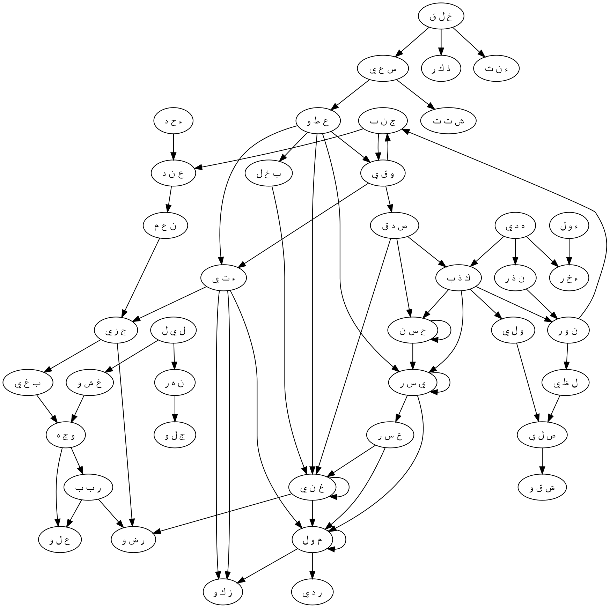

# S92:1–21 Nihai Bütünleştirme Raporu

## Kapsam ve veri disiplini

Bu rapor yalnız S92’ye ait dense özetleri ve üç perikop paketini bütünleştirir. `DENSE_PASSAGE_GATE.json`, bütün-sûre mekanik aday havuzunun `16,709 > 10,000` olması nedeniyle geçidi `failed` olarak kaydetmiştir. Bu yoğun havuz bir etkinleştirme paketi gibi kullanılmamış; 92:1–8, 92:9–16 ve 92:17–21 paketlerinin etkinleştirme, mekanizma, ikincil genişletme, graph ve discovery-ranking kayıtları ayrı ayrı incelenmiştir. `10-discovery-ranking.json` yalnız sürpriz değeri için mekanik inceleme kuyruğudur; yorumun sahibi değildir.

Kök çözümleme denetimi temizdir: 41 yüzey kökünün tamamı çözülmüş, eksik veya dışarıda bırakılmış kök yoktur. Bütün-sûre envanteri 334 benzersiz branch içerir (`qnet=322`, `furuq=334`). Perikoplarda 363 bağlamsal branch sınıflandırması bulunur; fark, `ح س ن`, `غ ن ي`, `ي س ر`, `م و ل` ve `و ق ي` köklerinin birden fazla perikopta farklı işlevlerle yeniden değerlendirilmesinden doğan 29 bağlamsal tekrardır.

| Birim | Ayet | Bağlamsal kök | Bağlamsal branch | A | B | C/B | C | S | X | Graph düğümü | Graph kenarı |
|---|---:|---:|---:|---:|---:|---:|---:|---:|---:|---:|---:|
| p01 | 1–8 | 16 | 110 | 16 | 30 | 24 | 40 | 0 | 0 | 16 | 1,663 |
| p02 | 9–16 | 16 | 126 | 21 | 29 | 17 | 55 | 4 | 0 | 16 | 2,305 |
| p03 | 17–21 | 14 | 127 | 16 | 21 | 26 | 55 | 9 | 0 | 14 | 2,631 |
| **Bağlamsal toplam** | **1–21** | **46** | **363** | **53** | **80** | **67** | **150** | **13** | **0** | **46** | **6,599** |
| **Benzersiz bütün-sûre envanteri** | **1–21** | **41** | **334** | — | — | — | — | — | — | **41** | — |

Dense aday özeti 16,179 kökler-arası, 530 aynı-kök olmak üzere 16,709 aday içerir; Q2 adayı yoktur. Bu sayılar olasılık alanını gösterir, aşağıdaki yorumları otomatik olarak doğrulamaz.

## Kısa nihai rapor

Sûre, gece/gündüz ve erkek/dişi gibi yaratılmış karşıtlıklarla başlar. Gece örter, gündüz görünür olur; erkek ve dişi aynı yaratma fiilinin farklılaşmış eşleridir. Bu çiftler ahlâkî olarak iyi/kötü diye eşlenmez. İşlevleri, farkın yaratılış düzeninde gerçek olabileceğini ve insan çabalarının da aynı değerde olmadığını göstermektir. `إِنَّ سَعْيَكُمْ لَشَتَّىٰ`, insanın çalışmasını ve yönelişini farklı yollara dağıtır.

İlk yol vermek, taqwā ile sınırı korumak ve `ٱلْحُسْنَىٰ`yı doğrulamakla kurulur. Vermek malı dışarı aktarır; taqwā eylemi koruyucu bir ölçüye yerleştirir; doğrulama ise en güzel iyiliğin, vaadin ve sonucun gerçekliğini tanır. İlâhî kolaylaştırma bu oluşmuş yönelimi `ٱلْيُسْرَىٰ`ya doğru yürünebilir kılar. Kolaylık servetin adı değil, veren ve doğrulayan öznenin seçimiyle uyumlu hâle gelen yoldur.

Karşı yol cimrilik ve kendini ihtiyaçtan bağımsız saymakla açılır; `ٱلْحُسْنَىٰ`yı yalanlamakla tamamlanır. Bu reddediş de `ٱلْعُسْرَىٰ`ya doğru kolaylaştırılır: İlâhî kolaylaştırma zor yolu iyi veya haz verici yapmaz, öznenin ısrarla kurduğu yönü giderek daha geçilebilir bir güzergâha dönüştürür. Böylece seçim eylem üretir, tekrar edilen eylem yatkınlık üretir, yatkınlık da sonuca doğru yol bağımlılığı oluşturur.

Mal bu iki yolun ayırıcı sınavıdır. Tutulan mal, sahibinin çöktüğü anda ona yetmez; ilk bölümdeki sahte `ٱسْتَغْنَىٰ` iddiası ikinci bölümde `وَمَا يُغْنِى عَنْهُ مَالُهُ` ile kendi kökü üzerinden çürütülür. Buna karşı son bölümde aynı mal dışarı verilir ve verenin arınmasına vesile olur. Sûre serveti kendi başına mahkûm etmez; malın elde tutulup bağımsızlık iddiasına mı, yoksa ihtiyaç ilişkisini tanıyıp arınmaya mı çevrildiğini sorar.

Rehberliğin Allah’a ait olduğu, hem ilk hem son hayatın O’na ait bulunduğu bildirilir. Ardından ateş henüz varılmamışken açıkça gösterilir: Uyarı, sonucun bilgisini yolculuk tamamlanmadan verir. Ateş önce görülebilir bir tehlike işareti, sonra reddediş ve yüz çevirmenin içinde biçimlenen en bedbaht kişi için yaşanan sonuçtur. Bu nedenle azap, açıklanmamış bir varış değil; rehberlik ve uyarıdan ısrarla uzaklaşmanın nihai hâlidir.

Son beş ayet olumlu yolun iç yapısını tamamlar. En çok sakınan kişi ateşten uzaklaştırılır; kendi malını arınmak için verir. Fakat metin yalnız eylemi değil niyeti de denetler: Bu transfer hiçbir insanın önceki iyiliğini geri ödemek, bir borcu kapatmak veya sosyal itibar satın almak için değildir. Bütün insanî karşılık iddiaları çıkarıldıktan sonra tek maksat kalır: En Yüce Rabbin Yüzünü aramak. Gelecekteki hoşnutluk, insanlarla kurulmuş bir takasın bedeli değil, bu saf yönelişe verilen ilâhî lütuftur.

Bütün sûrenin birincil mekanizması şöyledir:

```text
yaratılmış örtü/açıklık ve farklılaşmış eşler
→ insan çabasının farklı yönlere dağılması

vermek + taqwā + en güzeli doğrulamak
→ seçime cevap veren kolaylaştırma
→ kolay yola yöneliş
→ malı dışarı aktararak arınma
→ insanî borç ve itibar maksatlarından ayrışma
→ En Yüce Rabbin Yüzüne tek yönelim
→ ateşten uzaklaştırılma ve vaat edilmiş hoşnutluk

cimrilik + bağımsızlık iddiası + en güzeli yalanlamak
→ seçime cevap veren kolaylaştırma
→ zor yola yöneliş
→ malın çöküşte işe yaramaması
→ rehberlik ve uyarıdan yüz çevirme
→ uyarı ateşinin yaşanan sonuca dönüşmesi
```

İkincil okumalar ana hattı daha ilişkisel ve dinamik kılar. Vermek yalnız miktar eksiltmek değil, ihtiyacı görüp desteğin gerçekten yetmesini sağlamaktır; kolaylaştırma dışarıdan eklenmiş ödül değil, gevşetilmiş tutuşun ve edinilmiş hazır oluşun yürünebilir hâle gelmesidir. Niyet denetimi, ateşten fizikî ayrılma ile insanî borç/itibar ekonomisinden motivasyonel ayrılmayı aynı sınır mantığında birleştirir. İnsanlardan karşılık beklememek karşılığı tümden reddetmez: yatay takas dışarıda bırakılırken, ilâhî koruma ve hoşnutluk pazarlık edilmemiş dikey lütuf olarak gelir.

## Etkinleşmiş branch tablosu

Aşağıdaki tablolar bütün `A`, `B` ve `C/B` branch’leri korur. Her satır ortak işlevi, yerel delili, etkinleşme akışını ve yalnız yüzey anlamıyla kaybolacak unsuru özetler.

### p01 — 92:1–8

| Kök | A | B | C/B | İşlev, delil ve etkinleşme akışı | Yüzeyde kaybolan |
|---|---|---|---|---|---|
| `ل ي ل` | `B001` | `B002` | `B003` | Gece doğrudan örter; karanlıktaki etkinlik ve tekrarlanan yakın zaman `غ ش و`dan insan çabasına geçişi destekler. | Kozmik safhanın eylem için zaman alanı oluşu. |
| `غ ش و` | `B001` | `B003, B004` | `B002` | Örtme; hedefe ulaşma ve yaratılmış eşlerin birlikteliğiyle sosyal ilişki/karşılaşma portu açar. | Örtünün yalnız karanlık değil ilişkiyi gizleyen veya barındıran yapı oluşu. |
| `ن ه ر` | `B002` | `B003` | `B004` | Gündüz açılır ve salıverir; `ج ل و` ile davranışın görünürleşmesini sağlar. | Gündüzün epistemik ve sosyal açıklığı. |
| `ج ل و` | `B001` | `B002, B006, B007` | `B003, B009` | Tecellî; berraklık, kamusal tanınma ve açık gündüz üzerinden hakikatin eylemde görünmesini kurar. | Doğrulamanın kamusal iz ve itibar boyutu. |
| `خ ل ق` | `B002` | `B001, B003, B004, B005` | `B006, B007` | Yaratma; ölçü, bedenî form, mizaç ve yatkınlık verir; `س ع ي` bu kapasiteyi edinilmiş yola dönüştürür. | Yaratılmış yatkınlığın sabit ahlâkî kader olmaması. |
| `ذ ك ر` | `B001` | `B004, B007, B009` | `B002, B003, B005, B008` | Erkek yüzey anlamıdır; anma, tanıklık, ün, öğüt ve kayıt portları `ص د ق` ile kamusal doğruluk altkatmanı kurar. | Biyolojik kimlikten ahlâkî hatırlama/tanıklığa geçiş; cinsiyet-yol eşlemesi yapılmaz. |
| `ء ن ث` | `B001` | — | `B002, B004` | Dişi doğrudan yaratılmış eş; yumuşaklık ve cinsiyet farkı portları yalnız tamamlayıcılık düzeyinde kalır. | Biyolojik farkın ahlâkî öz olmadığının korunması. |
| `س ع ي` | `B002` | `B001, B006` | `B003, B005, B008` | Çaba, amaçlı hareket, cömertlik/adalet ve karşılaştırmalı performans olarak `ش ت ت`ten `ع ط و`ya yol kurar. | Tekil fiiller yerine yön üreten tekrar ve hareket. |
| `ش ت ت` | `B001` | `B003` | — | Dağınık/farklı yollar, iki çaba arasında gerçek ahlâkî mesafe kurar. | Farklılığın yalnız çeşitlilik değil yönsel ayrışma olması. |
| `ع ط و` | `B002` | `B001, B003, B005, B006` | `B004` | Vermek; elde tutulan şeyi aktarma, destek, muhtaç alıcı ve gevşeyen direnç olarak `و ق ي`, `ص د ق`, `ي س ر`e akar. | Transferin inancı eyleme ve desteğe çevirmesi. |
| `و ق ي` | `B002` | `B001` | — | Taqwā, zarar karşısında koruyucu sınırdır; vermeyi kalıcı ve disiplinli kılar. | Taqwānın pasif korku değil eylemi koruyan ölçü olması. |
| `ص د ق` | `B001` | `B002, B003, B004, B006` | `B005, B007` | Doğrulama; bütünlük, yerleşmiş değer, yerine getirme ve hakkı aktarma olarak `ح س ن`ı eylemde tasdik eder. | İnanç ile mal transferinin tek mekanizma oluşu. |
| `ح س ن` | `B003` | `B001, B002` | `B005` | `ٱلْحُسْنَىٰ`, güzel iyi, iyilik eylemi, vaat edilen karşılık ve en yüksek hedefi birleştirir. | İnanç nesnesi, eylem kalitesi ve yol sonunun hizalanması. |
| `ي س ر` | `B001` | `B005` | `B003, B006` | Kolaylaştırma; dirençsiz hareket, ikincil refah ve artış portlarıyla edinilmiş hazır oluşu geçilebilir kılar. | Kolaylığın zenginlikle özdeş değil yol niteliği oluşu. |
| `ب خ ل` | `B001` | — | — | Cimrilik doğrudan malı tutar ve `غ ن ي`nin bağımsızlık iddiasını açar. | Tutmanın ilişkisel ihtiyacı reddetmesi. |
| `غ ن ي` | `B001` | `B002` | `B004, B006` | İstiğnā, ihtiyaçsızlık iddiasıdır; gerçek destek/yetme ve hane yeterliliği portları, sahte bağımsızlığı ilişkisel yeterlilikle karşılaştırır. | Zenginlik ile gerçekten yetmek/destek olmak arasındaki fark. |

### p02 — 92:9–16

| Kök | A | B | C/B | İşlev, delil ve etkinleşme akışı | Yüzeyde kaybolan |
|---|---|---|---|---|---|
| `ك ذ ب` | `B001, B002` | `B008` | `B003, B004` | Yalanlama; yoz niyet, reddedilen yükümlülük ve başarısız emanet olarak `ح س ن`dan `ع س ر` ve `و ل ي`ye gider. | Yanlış görüşün zamanla karakter ve yol üretmesi. |
| `ح س ن` | `B001, B003` | `B002, B005` | — | Reddedilen `ٱلْحُسْنَىٰ`, güzellik, iyilik eylemi, karşılık ve nihai iyi hedeftir. | İnkârın eylem-vaat-sonuç bütününü reddetmesi. |
| `ي س ر` | `B001` | `B005` | `B003` | Kolaylaştırma, seçilmiş zor yönü de geçilebilir kılar; refah portu sahte “kolaylık” okumasını test eder. | İlâhî fiilin seçime cevap veren yol oluşumu olması. |
| `ع س ر` | `B001` | `B002, B004, B010` | `B008` | Zorluk; darlık, engel, zor kader ve malın baskıcı kullanımıyla servetin yönünü tersine çevirir. | Çok mala rağmen daralan hareket alanı. |
| `غ ن ي` | `B002` | `B001` | — | Malın yetmemesi yüzeydir; önceki kendine-yeterlik iddiası doğrudan kendi köküyle çürür. | İstiğnā ile gerçek faydanın ayrılması. |
| `م و ل` | `B001` | — | — | Mal, çöküş anında `غ ن ي`den `ر د ي`ye bağlanan başarısız kurtarma aracıdır. | Mülkün var kalırken işlevini kaybetmesi. |
| `ر د ي` | `B003` | — | `B002, B005` | Düşüş/helâk; hızlanan iniş ve ölçüyü aşan mal portlarıyla yön, kontrol ve ölçek çöküşünü birleştirir. | Aşırı miktarın düşüşü durduramaması. |
| `ه د ي` | `B001` | `B002, B007, B010` | `B003, B004` | Rehberlik; yön, sığınak, ahlâkî sebat ve lütuf olarak yalanlamaya karşı açıklama sağlar. | Uyarının merhametli yön ve armağan oluşu. |
| `ء خ ر` | `B001, B004` | `B002` | — | Ahiret ve son, ertelenmiş karşılığı ilk hayatla tek ilâhî yayda birleştirir. | Sonucun ilk hayattan kopuk olmayışı. |
| `ء و ل` | `B001` | `B002, B004` | `B007` | İlk hayat; sonuca dönüş, ilâhî yönetim ve değerlendirilen hâl olarak `ء خ ر`e akar. | “İlk”in içinde son anlamın şimdiden bulunması. |
| `ن ذ ر` | `B001` | — | `B002` | Açık uyarı, bilgi yanında bağlayıcı ahlâkî talep olarak `ن و ر`u görünür kılar. | Azaptan önce bilgisizliği kaldıran sorumluluk. |
| `ن و ر` | `B002` | `B001, B003, B005, B007, B010` | `B006` | Ateş; ışık, uzaktan sinyal, işaret, alevlenme ve şaşkınlık/kaçış portlarıyla rehberlikten cezaya dönüşür. | Ateşin önce görülen uyarı, sonra yaşanan sonuç oluşu. |
| `ل ظ ي` | `B001, B002, B004` | `B003` | — | Alevlenme ve cehennem ateşi, yanıcı yoğunlukla `ص ل ي`de yaşanan ısıya dönüşür. | Uyarının maddîleşen nihai biçimi. |
| `ص ل ي` | `B003` | `B004, B005` | `B001, B007` | Ateşe girip yanma; tutuşturma, yakalanma ve izleyen kişi portlarıyla `ش ق و` ve `و ل ي` sonucunu kurar. | Azabın ilişkiyi ve yönelişi tamamlayan son hâl olması. |
| `ش ق و` | `B001` | `B002` | `B003` | En bedbaht oluş, yıkıcı mücadele ve derece portuyla yalanlama/yüz çevirmenin ürettiği durumu adlandırır. | Etiketin sebepsiz değil edinilmiş yolun sonucu olması. |
| `و ل ي` | `B007` | `B002, B003, B004, B006, B009, B012` | `B001, B008, B013` | Yüz çevirme; ardışık safhalar, ilişki, bakış, yakınlaşma, yakalanma ve atanmış sonuç olarak ateşe yön üretir. | Uzaklaşmanın başka bir sonuca yaklaşmak olması. |

### p03 — 92:17–21

| Kök | A | B | C/B | İşlev, delil ve etkinleşme akışı | Yüzeyde kaybolan |
|---|---|---|---|---|---|
| `ج ن ب` | `B003` | `B002, B011` | `B001, B005, B009` | Ateşten uzaklaştırılma; nearness, yan/mesafe ve koruyucu engel olarak taqwāya verilen ilâhî cevaptır. | Korunmanın kişinin kendi üretimi değil bahşedilen etkili mesafe oluşu. |
| `و ق ي` | `B002` | `B001` | — | En çok sakınan kişinin etkin öz-koruması `ج ن ب`te ilâhî koruyucu ayrılmayla cevaplanır. | Pratik ihtiyat ile bahşedilen kurtuluşun birlikte çalışması. |
| `ء ت ي` | `B002` | `B007` | `B001, B003, B011, B013` | Malı verme; verim/artış, geliş ve aktarım portlarıyla `م و ل`dan `ز ك و`ya hareket kurar. | Eksilen mülkün ahlâkî artış üretmesi. |
| `م و ل` | `B001` | — | — | Sahip olunan mal bu kez elde tutulmaz, arınma amacıyla dışarı aktarılır. | Aynı servetin p02’de kurtaramazken p03’te arınma aracı olması. |
| `ز ك و` | `B002` | `B001, B003` | `B004` | Arınma; büyüme, sadaka ve uygunlukla verme eylemini içsel gelişime çevirir. | Mal ve niyetin çifte arınması. |
| `ء ح د` | `B002` | — | `B001` | Olumsuzluk altında her insanî alacaklıyı dışlar; birlik portu `إِلَّا` sonrası tek maksadı destekler. | Muhtemel karşılık sahiplerinin tek tek çıkarılması. |
| `ع ن د` | `B004` | — | `B005` | Giver yanında bulunan önceki iyilik/alacak konumunu belirler; sınır portu motivasyon alanını daraltır. | “Yanında”nın sosyal borç denetimi olması. |
| `ن ع م` | `B001` | `B013` | `B002, B010, B011` | İnsanî nimet/iyilik karşılığı reddedilir; rahatlık, sevinç ve göz/kalp ferahlığı gelecekteki hoşnutluğa altkatman verir. | İnsan nimeti ile ilâhî lütfun asimetrisi. |
| `ج ز ي` | `B001` | `B002` | `B003, B005` | Denk karşılık; ikame, borç tahsili ve güç ilişkisi portlarıyla reddedilen yatay takası tanımlar. | Vermenin karşılıklı bedel alışverişi olmaması. |
| `ب غ ي` | `B001` | — | `B002, B008, B009` | Aramak, `إِلَّا` sonrası tek niyettir; yönelim, dua ve ısrarlı talep portları `و ج ه`e akar. | Eylemin maksatsız değil tek-merkezli olması. |
| `و ج ه` | `B004, B005` | `B001, B002, B006, B008` | `B003, B014` | Rabbin Yüzü ilâhî Zât ve saf niyettir; yön, karşılaşma, itibar ve zararlı yönden çevrilme portları niyet coğrafyasını kurar. | Sosyal “yüz” yerine ilâhî yönelişin seçilmesi. |
| `ر ب ب` | `B001` | `B002, B003, B011, B016` | `B005, B007` | Rablik; yetiştirme, ahlâkî öğretim, ahit ve lütufla koruma/hoşnutluk hattını tamamlar. | Aranan Rabbin aynı zamanda sonucu yetiştiren fail olması. |
| `ع ل و` | `B001, B002` | `B005, B007` | `B004, B006, B011` | En Yüce; üstün mertebe, onur, etkili güç ve değer yönü olarak insanî itibar ekonomisini aşar. | Yüksekliğin fizikî değil değer ve yetki hiyerarşisi. |
| `ر ض و` | `B001` | `B002, B004, B006` | `B003` | Gelecek hoşnutluk; bol onay, ilâhî ödül, bağlılık ve karşılıklı rıza portlarıyla yolu kapatır. | İnsanî ödeme reddedilirken ilâhî lütfun korunması. |

## İkincil etkinleşme tablosu

Bu tablo `07-secondary-expansion.json` içindeki bütün 21 alternatif mekanizmayı korur. `suggested_label`, ikincil genişletmedeki öneridir; ana branch etiketlerini sessizce değiştirmez.

| Perikop | Mekanizma adı | suggested_label | Branch yolu/portları | Birincil okumaya katkısı |
|---|---|---|---|---|
| p01 | `concealed_relation_becomes_disclosed_truth` | `B` | `غ ش و B001/B005 → ج ل و B001/B002/B006/B008 → ذ ك ر B003/B004/B007 → ص د ق B001/B003/B004 → ع ط و B002/B003/B005 → غ ن ي B001/B002` | Örtülü ihtiyaç ve bağımlılık, görünür hakikate ve gerçekten destek olan vermeye dönüşür. |
| p01 | `created_capacity_becomes_acquired_course` | `B` | `خ ل ق B001/B003/B004/B005/B006 → س ع ي B001/B002/B006/B008 → ش ت ت B001/B003 → ع ط و B002/B004/B006 → و ق ي B001/B002 → ي س ر B001/B005` | Yaratılış kapasite verir; çaba ve tekrar onu edinilmiş, kolaylaştırılabilir yola çevirir. |
| p01 | `encounter_with_need_reveals_true_sufficiency` | `B` | `غ ش و B003 → س ع ي B001/B002/B006 → ع ط و B003/B005 → غ ن ي B001/B002` | Başkasının ihtiyacıyla karşılaşma, özel bağımsızlık iddiasını gerçek ve paylaşılan yeterlilikle sınar. |
| p01 | `property_as_measured_obligation` | `C/B` | `خ ل ق B001 → و ق ي B002/B004 → ذ ك ر B008 → ع ط و B001/B002/B003 → ص د ق B004/B006/B007 → ب خ ل B001` | Mülk etik olarak nötr değildir; ölçü ve tanınan hak içinde verilmesi veya tutulması sorumluluk üretir. |
| p01 | `guarded_gait_becomes_pliant_facilitation` | `C/B` | `س ع ي B001/B002 → و ق ي B002/B003 → ع ط و B004/B006 → خ ل ق B005/B008 → ي س ر B001/B005` | Taqwā yönü korur, verme direnci gevşetir, kolaylaştırma edinilmiş hazır oluşu yürünebilir kılar. |
| p01 | `prosperity_is_not_the_definition_of_ease` | `B` | `ح س ن B001/B002/B003/B005 → ي س ر B001/B003/B005 → ع ط و B002/B003/B005 → غ ن ي B001/B002 → ب خ ل B001` | Refah kolaylıkla kesişebilir, fakat kolay yolu tanımlayan iyilik, transfer ve destektir; servet değildir. |
| p01 | `truthful_transfer_as_relational_household_analogue` | `C/B` | `ذ ك ر B001/B008 → ء ن ث B001 → غ ش و B004 → ج ل و B009 → ص د ق B004/B007 → ع ط و B002/B003 → غ ن ي B002/B006` | En yüksek evlilik/mehir kümesi, desteğin ilişki ve yükümlülük kurmasına sınırlı analoji verir; ayetler evlilik hakkında değildir. |
| p02 | `mercy_and_blessing_rejected_before_fire` | `C/B` | `ص ل ي B002 → ح س ن B003 → ه د ي B004 → ن ذ ر B001 → ن و ر B003 → ك ذ ب B002 → ل ظ ي B002 → ص ل ي B003` | Basmala altında reddedilen şey merhametli vaattir; ateş yaşanmadan önce uyarı olarak görünür. |
| p02 | `obligation_liability_and_deserved_judgment` | `C/B` | `ك ذ ب B003/B004 → ن ذ ر B002 → ع س ر B003 → ن ذ ر B003 → و ل ي B008 → ش ق و B003` | Uyarı yükümlülük kurar; inkâr emaneti bozar; borç/tazmin imgeleri hak edilmiş hükmün analojisidir. |
| p02 | `guidance_as_gift_beyond_exchange` | `B` | `ه د ي B004 → ح س ن B002/B005 → م و ل B001 → و ل ي B014 → غ ن ي B002 → ر د ي B003` | Rehberlik lütuftur; mal onu satın alamaz veya çöküşte onun yerine geçemez. |
| p02 | `warning_signal_flight_and_entrapment` | `B` | `ه د ي B001 → ن ذ ر B001 → ن و ر B003/B005/B006 → و ل ي B007 → ص ل ي B005/B003` | Kişi uyarı işaretinden kaçar; tekrar eden kaçış kararsızlığa ve aynı ateşte yakalanmaya dönüşür. |
| p02 | `wealth_cannot_shelter_or_carry_at_death` | `C/B` | `غ ن ي B004 → م و ل B001 → غ ن ي B002 → ه د ي B007 → ر د ي B003 → ء و ل B008 → ص ل ي B003` | Yerleşiklik ve mülk dünya sığınağı sunabilir; çöküşte taşıyabilir ama kurtaramaz. |
| p02 | `assigned_priority_and_exclusive_rank` | `B` | `و ل ي B013/B008 → ء و ل B007 → ش ق و B003 → ص ل ي B007/B003` | “Yalnız en bedbaht” ifadesi, reddedişle oluşmuş hâle uygun atanmış sonuç ve derece bildirir. |
| p02 | `visible_disclosure_of_first_and_later` | `C/B` | `ء و ل B001/B006 → ن و ر B001/B005 → ه د ي B001 → ن ذ ر B001 → ء خ ر B004` | İlk hayattaki uyarı, son hayatın sonucunu daha varılmadan görünür kılar. |
| p02 | `wealth_cannot_bargain_with_outcome` | `C/B` | `ر د ي B006 → ك ذ ب B001 → ع س ر B004 → ه د ي B004 → و ل ي B014 → غ ن ي B002 → ر د ي B003 → و ل ي B012` | Mal ve retorik dünyevî ilişkileri yönetebilir, fakat sonucun pazarlığını yapamaz. |
| p03 | `protective_distance_mirrors_motivational_distance` | `B` | `ج ن ب B003/B011 → و ق ي B001 → ء ح د B005 → ع ن د B002 → و ج ه B014` | Ateşten bedenî uzaklık, verme niyetinin insanî alacak ve borçtan uzaklığıyla aynı sınır mantığını taşır. |
| p03 | `voluntary_gift_defined_against_levy_and_debt` | `C/B` | `ء ت ي B002/B008 → م و ل B001 → ن ع م B001 → ج ز ي B001/B002/B003/B004` | Transfer; vergi, borç taksiti, iyilik iadesi veya zorla alınmış ödeme olmayışıyla tanımlanır. |
| p03 | `property_released_as_cultivated_provision` | `C/B` | `م و ل B001 → ء ت ي B002 → ن ع م B005 → ج ن ب B010 → ء ت ي B007 → ز ك و B001 → و ج ه B012 → ر ب ب B002` | Mülk bırakıldığında geçim kaynağına, saf niyet altında yetiştirilen ahlâkî verime dönüşür. |
| p03 | `sideward_from_harm_upward_toward_highest_value` | `B` | `ج ن ب B001/B003 → ء ت ي B010 → و ج ه B002/B006 → ع ل و B001/B002/B005` | Kişi ateşten yana çekilirken niyeti En Yüce değere yönelir; bu fizikî kozmografi değil ilişkisel vektördür. |
| p03 | `single_face_displaces_the_reputation_economy` | `B` | `ء ح د B001/B002 → و ج ه B001/B004/B005/B015/B006 → ع ل و B002` | Sosyal yüz ve itibar ekonomisi çıkarılır; tek maksat En Yüce Rabbin Yüzüdür. |
| p03 | `horizontal_nonexchange_opens_to_vertical_benefaction` | `B` | `ج ز ي B001 → و ق ي B002 → ر ب ب B016 → ر ض و B002/B004/B001` | İnsanî karşılıklı bedel alışverişi reddedilir; ilâhî koruma ve hoşnutluk sözleşmesiz lütuf olarak kalır. |

### C ve S rezervuarı

`C` branch’ler kompakt delil iziyle korunmuştur. `S`, görünür yerel tetikleyici bulunmadığını belirtir; `X` yoktur.

| Perikop | Kök | C | S | Kompakt delil izi |
|---|---|---|---|---|
| p01 | `ل ي ل` | `B004` | — | Laylā özel adı; ortak isim olan gece için yerel onomastik tetik yoktur. |
| p01 | `غ ش و` | `B005, B006, B007` | — | Bilinç, özel örtü ve hayvan işaretleri; yalnız örtü/açıklık ağı zayıf destek verir. |
| p01 | `ن ه ر` | `B001, B005, B006, B007, B008` | — | Gündüzün arazi, kuş, özel ad ve nesne portları; yerel ayrıntı yoktur. |
| p01 | `ج ل و` | `B004, B005, B008` | — | Beden görünümü ve yönelmiş bakış; açıklık yalnız keşif düzeyinde destekler. |
| p01 | `خ ل ق` | `B008, B009, B010, B011, B012` | — | Düz yüzey, beden dokusu ve tıkanma portları; yol açıklığına uzak maddî analojiler. |
| p01 | `ذ ك ر` | `B006` | — | Özel anma/kimlik dalı; erkek ve tanıklık bağlamı yalnız genel tetik sağlar. |
| p01 | `ء ن ث` | `B003, B005, B006, B007, B008` | — | Anatomi, kırılganlık ve koku portları; cinsiyet etik yol olarak okunmaz. |
| p01 | `س ع ي` | `B004, B007` | — | Özel rekabet/ritüel lot dalları; çaba yüzeyi mekanizmaya yükseltmez. |
| p01 | `ش ت ت` | `B002` | — | Anatomik aralık portu, ahlâkî mesafeye yalnız uzak analojidir. |
| p01 | `ع ط و` | `B007` | — | Özel karşılaşma/performans dalı; verme eyleminden düşük güvenli bağ. |
| p01 | `و ق ي` | `B003, B004, B005` | — | Korumalı yürüyüş, ölçü ve av portları; sınır/kalibrasyon ilk ikisini keşif düzeyinde tutar. |
| p01 | `ص د ق` | — | — | Bütün branch’ler `A/B/C/B` içindedir. |
| p01 | `ح س ن` | `B004` | — | Özel güzellik/iyilik dalı; `ٱلْحُسْنَىٰ` yalnız genel destek verir. |
| p01 | `ي س ر` | `B002, B004, B007, B008, B009, B010, B011` | — | Ölçü, taraf, lot, anatomi ve özel adlar; kolay yol için çoğu yerel tetikleyicisizdir. |
| p01 | `ب خ ل` | — | — | Tek branch doğrudan `A`dır. |
| p01 | `غ ن ي` | `B003, B005` | — | Özel zenginlik/giysi portları; bağımsızlık iddiasına uzak destek. |
| p02 | `ك ذ ب` | `B005, B006, B007, B009` | — | Hız, süt akışı, kaçış ve kumaş portları; reddediş/uyarı alanında keşif düzeyi. |
| p02 | `ح س ن` | `B004` | — | Özel güzel/iyi dalı; yüzeydeki `ٱلْحُسْنَىٰ` genel tetik sağlar. |
| p02 | `ي س ر` | `B002, B004, B006, B007, B008, B009` | `B010, B011` | Ölçü, taraf, hayvan/lot ve anatomi portları; iki özel ad dalı tetikleyicisizdir. |
| p02 | `ع س ر` | `B003, B005, B006, B007, B009, B011, B013` | `B012` | Borç, yön, hayvan ve özel zorluk dalları; `B012` için görünür yerel bağ yoktur. |
| p02 | `غ ن ي` | `B003, B004, B005, B006` | — | Yerleşiklik, giysi ve hane yeterliliği; mal/çöküş karşıtlığında keşif düzeyi. |
| p02 | `م و ل` | — | `B002` | İkinci mal dalı için görünür yerel tetikleyici yoktur. |
| p02 | `ر د ي` | `B001, B004, B006` | — | Özel düşüş, giysi ve pazarlık portları; çöküş hattında uzak kalır. |
| p02 | `ه د ي` | `B005, B006, B008, B009, B011` | — | İbadet, hane, yol ve özel yön portları; rehberlik yüzeyi yalnız genel destek verir. |
| p02 | `ء خ ر` | `B003` | — | Özel son/başka dalı; ahiret bağlamında düşük güvenli. |
| p02 | `ء و ل` | `B003, B005, B006, B008, B009, B010, B011` | — | Görünürlük, araç, otlak ve özel ilk dalları; yalnız temporal yay bazılarını açık tutar. |
| p02 | `ن ذ ر` | `B003` | — | Tazmin/yükümlülük analojisi; yüzey uyarısı doğrudan hukuk sahnesi kurmaz. |
| p02 | `ن و ر` | `B004, B008, B009, B011` | — | Çiçek, pigment ve yol izi; açık ateş/uyarıya uzak maddî portlar. |
| p02 | `ل ظ ي` | — | — | Bütün branch’ler `A/B` içindedir. |
| p02 | `ص ل ي` | `B002, B006, B008, B009, B010` | — | Merhamet karşıtı, ibadet ve bitki/ısı portları; ateşe giriş yalnız bazılarına karşıtlık sağlar. |
| p02 | `ش ق و` | `B004` | — | Özel bedbahtlık dalı; üstünlük derecesi yalnız genel tetik verir. |
| p02 | `و ل ي` | `B005, B010, B011, B014, B015, B016` | — | Ticaret, hayvan, ardıllık ve özel ilişki portları; yüz çevirme/sonuç hattında keşif düzeyi. |
| p03 | `ج ن ب` | `B004, B006, B007, B008, B010, B012` | — | Kirlilik, yağmur, bitki ve hayvan portları; koruyucu ayrılma/geçim için uzak analojiler. |
| p03 | `و ق ي` | `B003, B004` | `B005` | Korumalı yürüyüş ve ölçü açık tutulur; av portu tetikleyicisizdir. |
| p03 | `ء ت ي` | `B004, B005, B006, B008, B009, B010, B012` | — | Vergi, yol, üreme ve özel verme portları; gönüllü transferin karşıt/analojik alanı. |
| p03 | `م و ل` | — | `B002` | İkinci mal dalı için görünür yerel tetikleyici yoktur. |
| p03 | `ز ك و` | `B005` | — | Özel arınma dalı; büyüme/sadaka alanından zayıf destek. |
| p03 | `ء ح د` | `B003, B004, B005` | `B006` | Sayı, tekillik ve yalnızlık portları; kapsamlı olumsuzluk bazılarını açar, `B006` tetikleyicisizdir. |
| p03 | `ع ن د` | `B001, B002, B003, B006` | — | Ayrılma, direnç ve özel konum portları; sosyal borç denetiminde keşif düzeyi. |
| p03 | `ن ع م` | `B003, B004, B005, B008, B009, B012` | `B006, B007` | Geçim, hayvan ve rahatlık portları; iki özel dal tetikleyicisizdir. |
| p03 | `ج ز ي` | `B004` | — | Zorunlu ödeme/harç, gönüllü hediyenin negatif modelidir. |
| p03 | `ب غ ي` | `B003, B004, B005, B006, B007` | — | Zorbalık, cinsellik ve yağmur portları; saf aramanın reddedilen karşıtları. |
| p03 | `و ج ه` | `B007, B009, B010, B012, B013, B015` | `B011` | Yetiştirme, çift-yüzlülük ve özel yön portları; `B011` için yerel bağ yoktur. |
| p03 | `ر ب ب` | `B004, B006, B008, B009, B010, B012, B013, B014, B017` | `B015` | Bulut, araç, bitki ve özel rablik dalları; `B015` tetikleyicisizdir. |
| p03 | `ع ل و` | `B003, B008, B009, B010` | `B012` | Kibir, araç ve özel yükseklik portları; `B012` yerel tetikleyicisizdir. |
| p03 | `ر ض و` | `B005` | `B007` | Rekabetçi tatmin reddedilen karşıttır; `B007` için görünür tetik yoktur. |

## Graph-ready kök/kenar tanımı

Graph düğümleri köklerdir; branch ID’leri kenar üzerindeki delil portlarıdır. Yeniden geçen kökler `context` ile ayrılır. `layer="whole"`, perikoplar-arası entegrasyon çıkarımıdır ve yeni branch etiketi üretmez.



## Most surprising discoveries

1. **Aynı mal iki karşıt işlev kazanır.** p02’de `م و ل B001`, tutulmuş servet olarak çöküşü durduramaz; p03’te yine `م و ل B001`, dışarı aktarılarak `ز ك و B001/B002/B003` arınma ve artış üretir. Metin “mal kötüdür” demez: malı koruyucu sanan tutuş ile malı başkasına hayat ve kendine arınma olarak açan transferi karşılaştırır.

2. **İstiğnā iddiası kendi köküyle çürütülür.** p01’de kişi `غ ن ي B001` ile kendini ihtiyaçsız sayar; p02’de malı ona `غ ن ي B002` anlamında gerçekten yetmez ve fayda sağlamaz. İkincil ağdaki `ع ط و B005 → غ ن ي B002`, gerçek yeterliliğin başkasının ihtiyacına cevap veren destek olduğunu gösterir. Bağımsızlık iddiası ilişkiyi reddeder; gerçek yeterlilik ilişki içinde işler.

3. **Kolaylaştırma ödül/cezadan önce bir yol-ivme mekanizmasıdır.** Aynı `ي س ر B001/B005`, hem kolay hem zor istikameti giderek yürünebilir kılar. Verme tutuşu gevşetir (`ع ط و B006`), yüz çevirme ise başka sona yaklaşır (`و ل ي B001/B012/B013`). İlâhî kolaylaştırma seçimi iptal etmez; seçimin tekrarıyla edinilmiş hazır oluşu sonuç yönünde etkili hâle getirir.

4. **Ateşten uzaklık ile sosyal borçtan uzak niyet aynı sınır geometrisini taşır.** `ج ن ب B003/B011`, kişiyi ateşten ayırır; `ء ح د B005` ve `ع ن د B002/B004`, bütün insanî alacaklıları verme maksadından çıkarır. Kişinin bedeni tehlikeden uzaklaştırılır çünkü eylemi önce borç, itibar ve karşılık hesabından uzak tutulmuştur. Bu birebir nedensel denklem değil, güçlü kompozisyonel paralelliktir.

5. **Yatay takas reddedilirken dikey lütuf korunur.** `ج ز ي B001` insanî geri ödemeyi motivasyon olmaktan çıkarır; fakat `ر ب ب B016 → ر ض و B001/B002/B004` ilâhî lütuf ve hoşnutluğu getirir. Karşılık bütünüyle yok olmaz; sözleşmeli insan değişimi dışarıda bırakılır ve Rabbin pazarlık edilmemiş armağanı kalır.

6. **Uyarı ateşi rehberliğin son görünür biçimidir.** `ه د ي B001/B004 → ن ذ ر B001 → ن و ر B003/B005`, sonucun daha varılmadan sinyal ve işaret olarak görülmesini sağlar. `ك ذ ب B001 → ن و ر B010` uyarıyı şaşkınlığa çevirir; `ل ظ ي B002 → ص ل ي B003` ise görülen işareti yaşanan ateşe dönüştürür. Reddeden kişi ateşe habersiz varmaz; gördüğü yön levhasından yüz çevirerek varır.

7. **Kozmik örtü/açıklık, niyet denetimine dönüşür.** Başlangıçta gece örter ve gündüz açığa çıkarır; sonda görünürdeki cömertliğin altında ikinci bir yüz, sosyal borç veya itibar arayışı olup olmadığı sınanır. `غ ش و B005` ile perdelenmiş farkındalık, `و ج ه B005/B015` saf/çift-yüzlü niyet karşıtlığına uzanır. Ahlâkî açıklık, yalnız ne verildiğini değil kimin yüzünün arandığını görünür kılar.

8. **En yüksek mekanik keşif ev ekonomisi, gerçek yeterliliği ilişkisel gösterir.** `ص د ق B007 ↔ غ ن ي B006` mehir/hane yeterliliği köprüsü, `ع ط و B003` pratik destekle birleşir. Ayetler evlilik veya mehir hakkında değildir; güvenli sürpriz şudur: Doğru transfer, verenin malını azaltırken yükümlülük taşıyan ilişkiyi ve ortak yeterliliği kurabilir. Böylece `ٱسْتَغْنَىٰ`nın yalnızlaştırıcı yeterlilik iddiası daha keskin biçimde eleştirilir.

9. **Verme, eksilme görüntüsü altında yetiştirilen verimdir.** `ء ت ي B007 ↔ ز ك و B001` verme ile büyümeyi, `و ج ه B012 ↔ ر ب ب B002` saf niyetle yöneltilen yetiştirmeyi Rabbin tamamlayıcı terbiyesine bağlar. Mülk elden çıkar, fakat eylemin ahlâkî verimi büyür; bu, literal tarla/hasat anlatısı değil süreç analojisidir.

## Açık sorular

1. Gece/gündüz ile iki ahlâkî yol arasındaki analoji, geceyi kötü ve gündüzü iyi sayan kaba eşleştirmeye düşmeden nasıl korunmalıdır?
2. Erkek/dişi yaratılış çifti ile `سَعْيَكُمْ لَشَتَّىٰ` arasındaki geçiş, biyolojik yatkınlıkların ahlâkî kader olduğu sonucuna kapı açmadan ne kadar geliştirilebilir?
3. `فَسَنُيَسِّرُهُ`nun iki yolda da kullanılması, ilâhî kolaylaştırma ile insan seçimi arasındaki nedensellik sırasını tam olarak nasıl kurar?
4. `ٱلْحُسْنَىٰ` için `ح س ن B001/B002/B003/B005` iyi eylem, vaat ve son hedef katmanlarından hangisi bağlama göre önceliklidir?
5. `غ ن ي B001` kendine yeterlik iddiası ile `غ ن ي B002` gerçekten yetme/fayda verme arasındaki sûreiçi kelime oyunu, ekonomik zenginlikten psikolojik bağımsızlığa geçişi ne ölçüde taşır?
6. `ن و ر B003/B005` sinyal/işaret ışığı altkatmanı, açık uyarı bağlamında güçlüdür; ateşin rehberliğin “son görünür biçimi” olduğu formülasyonu hangi sınırda tutulmalıdır?
7. 92:17’de pasif `يُجَنَّبُهَا`, taqwā ile ilâhî koruma arasındaki ilişkiyi gösterir; öz-koruma ile bahşedilen kurtuluş arasındaki pay nasıl ifade edilmelidir?
8. 92:19’daki insanî karşılık reddi, toplumsal teşekkür ve karşılıklılığı tümden değersizleştirir mi, yoksa yalnız verme eyleminin belirleyici motivasyonunu mu arındırır?
9. `و ج ه B004/B005/B006` ilâhî Zât, saf niyet ve en yüksek itibar katmanları aktarılırken lafzî yüz veya insanî itibar ekonomisiyle karışma nasıl önlenmelidir?
10. Evlilik/mehir kümesi (`ص د ق B007 ↔ غ ن ي B006`) mekanik keşif sıralamasında çok güçlüdür; ilişki ve yükümlülük analojisi korunurken ayetlere evlilik sahnesi eklememe sınırı nasıl görünür tutulmalıdır?

## Sonuç

S92:1–21, yaratılmış farklardan edinilmiş ahlâkî yollara, yollardan servetin kullanımına, servetin kullanımından niyet ve sonuca ilerler. Veren, taqwā sahibi ve en güzeli doğrulayan kişi kolay yola hazırlanır; cimri, bağımsızlık iddiasındaki ve en güzeli yalanlayan kişi zor yola hazırlanır. Mal bir yolda çöküşü durduramayan sahte güvence, diğerinde arınma ve geçim üretmek üzere serbest bırakılan araçtır. Rehberlik ateşi daha varılmadan görünür kılar; saf niyet ise vermeyi insanî borç ve itibar hesabından ayırıp En Yüce Rabbe yöneltir. Son vaat, yatay takasın değil ilâhî koruma ve lütfun tamamladığı hoşnutluktur. Geniş ikincil rezervuar bu ana okumayı daraltmaz; yol, ivme, ihtiyaç, destek, mülk, borç, itibar, sınır, yön ve yetişme mekanizmalarıyla somutlaştırır.
